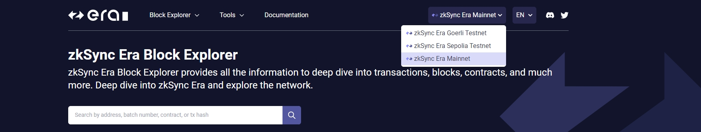

# WTF zkSync极简入门: 4. 开发工具

这个系列教程帮助开发者入门 zkSync 开发。
推特：[@0xAA_Science](https://twitter.com/0xAA_Science)｜[@WTFAcademy_](https://twitter.com/WTFAcademy_) 社区：[Discord](https://discord.gg/5akcruXrsk)｜[微信群](https://docs.google.com/forms/d/e/1FAIpQLSe4KGT8Sh6sJ7hedQRuIYirOoZK_85miz3dw7vA1-YjodgJ-A/viewform?usp=sf_link)｜[官网 wtf.academy](https://wtf.academy) 所有代码和教程开源在 github: [github.com/WTFAcademy/WTF-zkSync](https://github.com/WTFAcademy/WTF-zkSync)

---

这一讲，我们将介绍 zzkSync 的生态和一些常用的工具。

### 生态&工具

#### 1 区块链浏览器

[zkSync Era Block Explorer](https://explorer.zksync.io/)

`zkSync Era Block Explorer` 提供 zkSync 网络上所有交易、区块、合约等信息。可以在右上角下拉菜单中进行不同网络切换。



#### 2 zkSync 水龙头

[Chainstack Faucet](https://faucet.chainstack.com/zksync-testnet-faucet)


#### 3 zkSync CLI

[zkSync CLI](https://github.com/matter-labs/zksync-cli) 是一个用于简化 zkSync 开发与交互的命令行工具。它提供了诸如管理本地开发环境、与合约交互、管理代币等功能的命令。它包含以下命令及对应功能：

##### 3.1 dev

用于管理本地开发环境

- 所需环境
  
  - [nodejs@18 及以上]( https://nodejs.org/en )
  
  - [Git]( https://git-scm.com/downloads )
  
  - [Docker](https://www.docker.com/get-started/)

- 使用

```
npx zksync-cli dev start
```

首次运行时需要选择**节点类型**和**附加的模块**（后续可通过 `npx zksync-cli dev config` 修改）。

- 节点选择
  
  - In memory node：使用内存建立本地测试环境，只有 L2 节点，[测试账户地址和私钥](https://docs.zksync.io/build/test-and-debug/era-test-node.html#use-pre-configured-rich-wallets)。
  
  - Dockerized node：使用 Docker 建立本地测试环境，包含 L1 和 L2 节点。


- 附加模块选择
  
  - Portal：添加钱包和跨链桥相关功能。
  
  - Block Explorer：添加 zkSync 区块链浏览器 UI 和 API 相关功能。


> 后续演示环境：`In memory node` 且 `不安装附加模块`。

##### 3.2 config

用于配置自定义链。

##### 3.3 contract

用于操作链上合约（读、写等）。

##### 3.4 transaction

用于查询链上交易信息（交易状态、转账金额、gas 费用等）。

##### 3.5 create

用于快速创建项目（前端、智能合约和脚本）。


##### 3.6 wallet

用于管理与钱包相关的功能（转账、余额查询等）。

##### 3.7 bridge

用于处理以太网和 zkSync 之间跨链操作。

#### 4 zkSync Remix

[Remix IDE](https://remix.ethereum.org/) 也支持 zkSync 合约开发，只需要我们安装对应插件即可。下面我们将演示如何结合 `zksync-cli` 搭建本地开发环境，并部署一个最简单的合约。

##### 4.1 开启本地开发环境

在命令行工具中执行 `npx zksync-cli dev start`（需要启动 docker ）。

##### 4.2 安装插件

点击左边菜单栏底部的 `插件管理` 选项，搜索 `ZKSYNC` 并启用插件。启用成功后可以在左边菜单栏中看到 zkSync 的Logo，我们点击它进入 zkSync 的开发环境。


##### 4.3 案例测试

1. 新建文件 `HelloZkSync.sol`。

2. 编辑合约。

```solidity
// SPDX-License-Identifier: MIT
pragma solidity ^0.8.21;

contract HelloZkSync {
    string public str = "Hello zkSync!";
}
```

3. 编译合约，点击 `Compile HelloZkSync.sol` 进行编译。

4. 部署合约，在下方 `Environment selection` 中选择 `Local Devnet`，并部署 `HelloZkSync` 合约。


5. 合约交互，部署成功后，点击 `str` 即可在控制台中看到 `"Hello zkSync!"` 输出。至此，我们就完成了使用 [Remix IDE](https://remix.ethereum.org/) 开发一个简单的智能合约。

#### 5 Hardhat plugins

zkSync 官方也提供了 Hardhat 支持，并且我们可以使用 `zksync-cli` 快速创建 Hardhat 项目。

```
npx zksync-cli create
```

根据提示输入项目名称，选择 `Contracts` 选项，根据自己的需求选择 `Ethers` 版本（v6 / v5）、 `智能合约语言`（Solidity / Vyper）、部署私钥（可选）和依赖包管理方式。创建完成后即可使用 Hardhat 在 zkSync 上开发智能合约。

#### 6 Foundry with zkSync

[foundry-zksync](https://github.com/matter-labs/foundry-zksync) 允许用户使用 foundry 在 zkSync 上进行智能合约开发，引入 `zkforge` 和 `zkcast` 扩展了原有的 `forge` 和 `cast` 使开发人员能更加便捷地在 zkSync 进行开发。

#### 7 zksync-ethers

[zksync-ethers](https://github.com/zksync-sdk/zksync-ethers) 扩展了 `ethers` 库以支持 zkSync 特有的功能（如账户抽象）。

##### 7.1 安装

```
pnpm i zksync-ethers ethers@6
```

##### 7.2 连接到 zkSync Era 网络

```js
import { Provider, utils, types } from "zksync-ethers";
import { ethers } from "ethers";

const provider = Provider.getDefaultProvider(types.Network.Sepolia); // zkSync Era testnet (L2)
const ethProvider = ethers.getDefaultProvider("sepolia"); // Sepolia testnet (L1)
```
