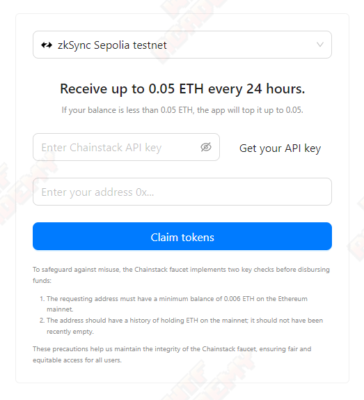
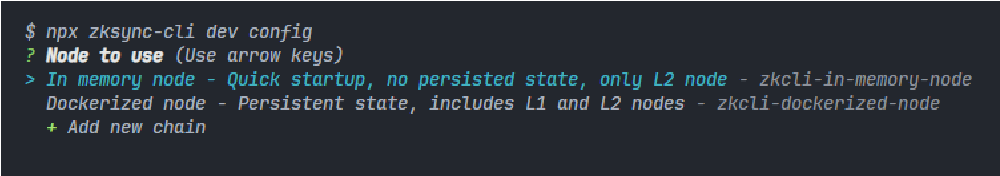
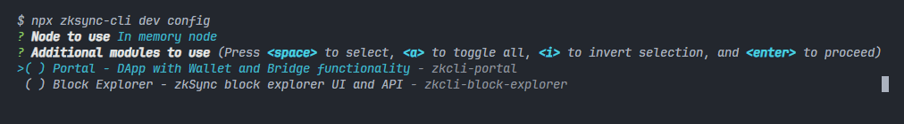
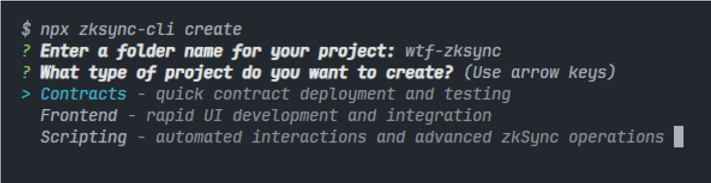
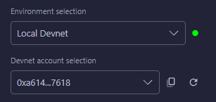

# WTF zkSync 极简入门: 4. 开发工具

这个系列教程帮助开发者入门 zkSync 开发。
推特：[@0xAA_Science](https://twitter.com/0xAA_Science)｜[@WTFAcademy_](https://twitter.com/WTFAcademy_) 

社区：[Discord](https://discord.gg/5akcruXrsk)｜[微信群](https://docs.google.com/forms/d/e/1FAIpQLSe4KGT8Sh6sJ7hedQRuIYirOoZK_85miz3dw7vA1-YjodgJ-A/viewform?usp=sf_link)｜[官网 wtf.academy](https://wtf.academy) 

所有代码和教程开源在 github: [github.com/WTFAcademy/WTF-zkSync](https://github.com/WTFAcademy/WTF-zkSync)

---

这一讲，我们将介绍 zkSync 的生态和一些常用的工具。


## 1. zkSync 水龙头

[Chainstack Faucet](https://faucet.chainstack.com/zksync-testnet-faucet)



## 2. zkSync CLI

[zkSync CLI](https://github.com/matter-labs/zksync-cli) 是一个用于简化 zkSync 开发与交互的命令行工具。它提供了诸如管理本地开发环境、与合约交互、管理代币等功能的命令。它包含以下命令及对应功能：

### 2.1 dev

用于管理本地开发环境

- 所需环境

  - [nodejs@18 及以上](https://nodejs.org/en)

  - [Git](https://git-scm.com/downloads)

  - [Docker](https://www.docker.com/get-started/)

- 使用

```
npx zksync-cli dev start
```

首次运行时需要选择 **节点类型** 和 **附加的模块**（后续可通过 `npx zksync-cli dev config` 修改）。

- 节点选择

  - In memory node：使用内存建立本地测试环境，只有 L2 节点，[测试账户地址和私钥](https://docs.zksync.io/build/test-and-debug/era-test-node.html#use-pre-configured-rich-wallets)。

  - Dockerized node：使用 Docker 建立本地测试环境，包含 L1 和 L2 节点。



- 附加模块选择

  - Portal：添加钱包和跨链桥相关功能。

  - Block Explorer：添加 zkSync 区块链浏览器 UI 和 API 相关功能。



> 后续演示环境：`In memory node` 且 `不安装附加模块`。

### 2.2 config

用于配置自定义链，添加/编辑自定义链命令如下

```
npx zksync-cli config chains
```

根据提示即可完成添加/编辑自定义链操作

```
? Select a chain (选择添加/编辑已添加的自定义链)
? Chain id (自定义链 id )
? Chain name (自定义链名名称)
? Chain key (自定义链 key, 默认为自定义链)
? Chain RPC URL (自定义链的 RPC URL)
? Chain explorer URL [可选](自定义链浏览器地址)
? Is this chain connected to L1 (自定义链是否连接 L1 )
```

### 2.3 contract

用于操作链上合约（读、写等），使用 `npx zksync-cli contract read` 命令，我们可以非常方便地读取链上信息，如获取某个地址的 Token 余额：

```
npx zksync-cli contract read
```

根据提示选择合约所在的链（为了方便测试，这里我们选择 `zkSync Sepolia Testne`）

```
? Chain to use (Use arrow keys)
> zkSync Sepolia Testnet
  zkSync Mainnet
  zkSync Goerli Testnet
  In-memory local node
  Dockerized local node
```

选择链之后，会要求输入合约地址（这里我们输入一个 ERC20 合约的地址做测试）

```
0x45E6dC995113fd3d1A3b1964493105B9AA9a9A42
```

zksync-cli 会自动为我们获取该地址对应合约的可读函数的函数签名（这里我们选择余额查询 `balanceOf(address account) view returns (uint2)` ）

```
? Contract method to call (Use arrow keys)
  ──────────────── Provided contract ────────────────
> allowance(address owner, address spender) view returns (uint256)
  balanceOf(address account) view returns (uint256)
  decimals() view returns (uint8)
  name() view returns (string)
  symbol() view returns (string)
  totalSupply() view returns (uint256)
  ───────────────────────────────────────────────────
  Type method manually
```

根据提示输入参数（根据函数签名可知，我们需要传入想要查询余额的地址）

```
0xa1cf087DB965Ab02Fb3CFaCe1f5c63935815f044
```

回车后我们就可以看到查询结果

```
√ Method response (raw): 0x00000000000000000000000000000000000000000000d3c20dee1639f99c0000
✔ Decoded method response: 999999000000000000000000
```

至此，我们就使用 `zksync-cli` 对合约进行读取的操作，是不是非常的方便？当然，zksycn-cli 的强大还远不止于此。

### 2.4 transaction

用于查询链上交易信息（交易状态、转账金额、gas 费用等）。我们可以使用交易哈希非常便捷地查询到对应的链上交易信息：

```
npx zksync-cli transaction info [options]
```

options：

- --full：查询详细信息

- --raw：显示原始 JSON 响应

接下来，我们使用 `zksync-cli` 查询 `zkSync Sepolia Testnet` 上交易哈希为 `0xb427c3abd0397caeaea64a18dbf2ad7b699c5da49fa54dd31d3267f63341d8ea` 的详细交易信息

```
npx zksync-cli transaction info --full
```

根据提示选择想要查询的链（这里我们为了测试方便，选择 `zkSync Sepolia Testnet`）

```
? Chain to use (Use arrow keys)
> zkSync Sepolia Testnet
  zkSync Mainnet
  zkSync Goerli Testnet
  In-memory local node
  Dockerized local node
```

根据提示输入交易哈希：`0xb427c3abd0397caeaea64a18dbf2ad7b699c5da49fa54dd31d3267f63341d8ea`

```
? Transaction hash 0xb427c3abd0397caeaea64a18dbf2ad7b699c5da49fa54dd31d3267f63341d8ea
```

回车后，`zksync-cli` 就可以为我们查询到对应的交易详情

```
──────────────────── Main info ────────────────────
Transaction hash: 0xb427c3abd0397caeaea64a18dbf2ad7b699c5da49fa54dd31d3267f63341d8ea
Status: completed
From: 0xF24D120C43a07D8A1005A0d4B7AA39b9aD775BE2
To: 0x75A8597FD8AfC39eAe22687E57609E54Fb663e7C  |  Implementation: 0x27abc420b5bd48761c1984dcafc9201386566c69
Value: 0 ETH
Fee: 0.0000360583 ETH  |  Initial: 0.0000968742 ETH  Refunded: 0.00008019074 ETH
Method: 0x8ce7b106

───────────────────── Details ─────────────────────
Date: 2024/4/7 22:26:31 (2 hours ago)
Block: #1513166
Nonce: 7
Transaction type: 2
Ethereum commit hash: 0xbac8f789c32418a0918756d3d3091e04ef2106185d5d9fb98cd000faf0cc7db3
Ethereum prove hash: in progress
Ethereum execute hash: in progress
```

### 2.5 create

用于快速创建项目（前端、智能合约和脚本）。

```
npx zksync-cli create
```



### 2.6 wallet

用于管理与钱包相关的功能（转账、余额查询等）。

- 余额查询

```
npx zksync-cli wallet balance [options]
```

options：

- --address：想要查询余额的地址

- --token：如果想要查询 ERC20 代币，可以添加此参数，并传入合约地址

- --chain：指定在哪条链上查询

- --rpc：指定 RPC URL

下面我们根据之前的例子，查询 `0xa1cf087DB965Ab02Fb3CFaCe1f5c63935815f044` 在测试网上的代币余额

```
npx zksync-cli wallet balance
--address 0xa1cf087DB965Ab02Fb3CFaCe1f5c63935815f044
--token 0x45E6dC995113fd3d1A3b1964493105B9AA9a9A42
--chain zksync-sepolia
```

查询结果

```
zkSync Sepolia Testnet Balance: 999999 DTN (DefaultTokenName)
```

当然，如果只是查询以太余额，我们可以只输入 `npx zksync-cli wallet balance` 命令并回车，`zksync-cli` 会自动提示我们选择要查询的链和想要查询的地址。

### 2.7 bridge

用于处理以太网和 zkSync 之间跨链操作。

- 使用 `deposit` 将资产 `从 L1 转移到 L2`

```
npx zksync-cli bridge deposit
```

- 使用 `withdraw` 将资产 `从 L2 转移到 L1`

```
npx zksync-cli bridge withdraw
```

## 3 zkSync Remix

[Remix IDE](https://remix.ethereum.org/) 也支持 zkSync 合约开发，只需要我们安装对应插件即可。下面我们将演示如何结合 `zksync-cli` 搭建本地开发环境，并部署一个最简单的合约。

### 3.1 开启本地开发环境

在命令行工具中执行 `npx zksync-cli dev start`（需要启动 docker ）。

### 3.2 安装插件

点击左边菜单栏底部的 `插件管理` 选项，搜索 `ZKSYNC` 并启用插件。启用成功后可以在左边菜单栏中看到 zkSync 的 Logo，我们点击它进入 zkSync 的开发环境。


### 3.3 案例测试

1. 新建文件 `HelloZkSync.sol`。

2. 编辑合约。

```solidity
// SPDX-License-Identifier: MIT
pragma solidity ^0.8.21;

contract HelloZkSync {
    string public str = "Hello zkSync!";
}
```

3. 编译合约，点击 `Compile HelloZkSync.sol` 进行编译。

4. 部署合约，在下方 `Environment selection` 中选择 `Local Devnet`，并部署 `HelloZkSync` 合约。



5. 合约交互，部署成功后，点击 `str` 即可在控制台中看到 `"Hello zkSync!"` 输出。至此，我们就完成了使用 [Remix IDE](https://remix.ethereum.org/) 开发一个简单的智能合约。

## 4 Hardhat plugins

zkSync 官方也提供了 Hardhat 支持，并且我们可以使用 `zksync-cli` 快速创建 Hardhat 项目。

```shell
npx zksync-cli create
```

根据提示输入项目名称，选择 `Contracts` 选项，根据自己的需求选择 `Ethers` 版本（v6 / v5）、 `智能合约语言`（Solidity / Vyper）、部署私钥（可选）和依赖包管理方式。创建完成后即可使用 Hardhat 在 zkSync 上开发智能合约。

## 5 Foundry with zkSync

[foundry-zksync](https://github.com/matter-labs/foundry-zksync) 允许用户使用 foundry 在 zkSync 上进行智能合约开发，引入 `zkforge` 和 `zkcast` 扩展了原有的 `forge` 和 `cast` 使开发人员能更加便捷地在 zkSync 进行开发。

## 6 zksync-ethers

[zksync-ethers](https://github.com/zksync-sdk/zksync-ethers) 扩展了 `ethers` 库以支持 zkSync 特有的功能（如账户抽象）。

### 6.1 安装

```shell
pnpm i zksync-ethers ethers@6
```

### 6.2 连接到 zkSync Era 网络

```js
import { Provider, utils, types } from "zksync-ethers";
import { ethers } from "ethers";

const provider = Provider.getDefaultProvider(types.Network.Sepolia); // zkSync Era testnet (L2)
const ethProvider = ethers.getDefaultProvider("sepolia"); // Sepolia testnet (L1)
```
