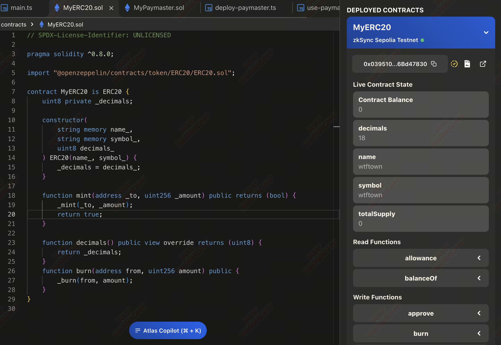
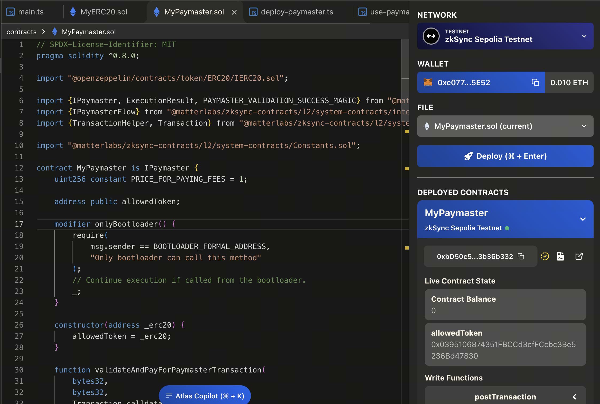
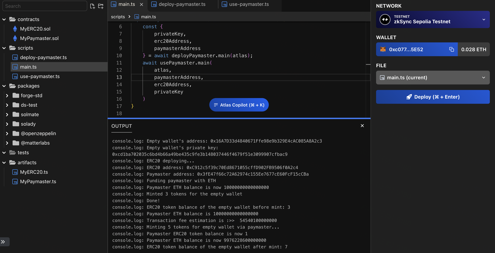

# WTF zkSync极简入门: 5. 合约开发

这个系列教程帮助开发者入门 zkSync 开发。

推特：[@0xAA_Science](https://twitter.com/0xAA_Science)｜[@WTFAcademy_](https://twitter.com/WTFAcademy_)

社区：[Discord](https://discord.gg/5akcruXrsk)｜[微信群](https://docs.google.com/forms/d/e/1FAIpQLSe4KGT8Sh6sJ7hedQRuIYirOoZK_85miz3dw7vA1-YjodgJ-A/viewform?usp=sf_link)｜[官网 wtf.academy](https://wtf.academy)

所有代码和教程开源在 github: [github.com/WTFAcademy/WTF-zkSync](https://github.com/WTFAcademy/WTF-zkSync)

---

这一讲，我们将介绍 `zkSync` 合约开发，并实现一个自定义的 `Paymaster Contract` 和一个 `ERC20 Contract`，而且允许用户使用 `ERC20` 进行 `gas` 支付。

## 1.背景知识：

0. [Solidity 基础知识](https://www.wtf.academy/docs/solidity-101/)
1. [账户抽象协议介绍](https://docs.zksync.io/build/developer-reference/account-abstraction.html)
2. [系统合约简介](https://docs.zksync.io/build/developer-reference/system-contracts.html)
3. [Node 环境](https://nodejs.org/en/download)

## 2. `ETH` 和 `zkSync` 的不同

zkSync Era 可以处理绝大多数基于以太坊虚拟机（EVM）的智能合约，并维持高安全标准，从而减少了重复进行安全审计的需求。但是，仍存在一定差异，必要情况下还请阅读 [差异文档](https://docs.zksync.io/build/developer-reference/differences-with-ethereum.html)。

## 3. 实现一个 `Paymaster` 合约

### 3.1 `IPaymaster` 接口定义

实现该合约之前，我们先了解下 `IPaymaster` 接口，[该接口定义如下](https://github.com/matter-labs/era-contracts/blob/main/system-contracts/contracts/interfaces/IPaymaster.sol)：

```solidity
// SPDX-License-Identifier: MIT

pragma solidity 0.8.20;

import "../libraries/TransactionHelper.sol";

enum ExecutionResult {
    Revert,
    Success
}

bytes4 constant PAYMASTER_VALIDATION_SUCCESS_MAGIC = IPaymaster.validateAndPayForPaymasterTransaction.selector;

interface IPaymaster {
    /// @dev 该函数有只能由 bootloader 调用用来验证该 paymaster 实现是否同意支付交易的费用，如果付款人愿意为交易付款，则此方法必须至少发送 tx.gasprice * tx.gasLimit 给 operator
    /// @param _txHash 交易的哈希值
    /// @param _suggestedSignedHash 由 EOA 签名的交易哈希值
    /// @param _transaction 交易本身
    /// @return magic 如果 paymaster 同意支付交易费用，则返回值应等于 validateAndPayForPaymasterTransaction 方法的签名。
    /// @return context 交易的“上下文”：长度最多为 1024 字节的字节数组，将传递给账户的 postTransaction 方法。
    /// @dev 开发者应尽量保留尽可能多的步骤，无论交易是否有效，因为这个方法也用于 gas 费用估算（不包括一些必要的数据，例如签名）。
    function validateAndPayForPaymasterTransaction(
        bytes32 _txHash,
        bytes32 _suggestedSignedHash,
        Transaction calldata _transaction
    ) external payable returns (bytes4 magic, bytes memory context);

    /// @dev 在交易执行后由 bootloader 调用。
    /// @param _context, 执行的“上下文”，由 "validateAndPayForPaymasterTransaction" 方法返回。
    /// @param  _transaction, 用户的交易
    /// @param _txResult, 交易执行结果（成功或失败）。
    /// @param _maxRefundedGas, 可退还给 paymaster 的 gas 上限。
    /// @dev 实际退还的金额取决于“postOp”本身消耗的燃气量，因此开发人员应考虑这一点。
    function postTransaction(
        bytes calldata _context,
        Transaction calldata _transaction,
        bytes32 _txHash,
        bytes32 _suggestedSignedHash,
        ExecutionResult _txResult,
        uint256 _maxRefundedGas
    ) external payable;
}
```

但有一点需要注意的是 `postTransaction` 是可选的，在交易执行后调用。请注意，与 EIP4337 不同的是，不能保证会调用此方法。特别是，如果交易因 `out of gas` 错误而失败，则不会调用此方法。

### 3.2 `Paymaster` 合约实现

整体合约框架如下：
```solidity
// SPDX-License-Identifier: MIT
pragma solidity ^0.8.0;

import {IPaymaster, ExecutionResult, PAYMASTER_VALIDATION_SUCCESS_MAGIC} from "@matterlabs/zksync-contracts/l2/system-contracts/interfaces/IPaymaster.sol";
import {IPaymasterFlow} from "@matterlabs/zksync-contracts/l2/system-contracts/interfaces/IPaymasterFlow.sol";
import {TransactionHelper, Transaction} from "@matterlabs/zksync-contracts/l2/system-contracts/libraries/TransactionHelper.sol";

import "@matterlabs/zksync-contracts/l2/system-contracts/Constants.sol";

import "@openzeppelin/contracts/token/ERC20/IERC20.sol";
import "@openzeppelin/contracts/access/Ownable.sol";

contract ApprovalPaymaster is IPaymaster, Ownable {
    uint256 constant PRICE_FOR_PAYING_FEES = 1;

    address public allowedToken;

    modifier onlyBootloader() {
        require(
            msg.sender == BOOTLOADER_FORMAL_ADDRESS,
            "Only bootloader can call this method"
        );
        _;
    }

    constructor(address _erc20) {
        allowedToken = _erc20;
    }

    function validateAndPayForPaymasterTransaction(
        bytes32,
        bytes32,
        Transaction calldata _transaction
    )
        external
        payable
        onlyBootloader
        returns (bytes4 magic, bytes memory context)
    {
        // 待实现
    }

    function postTransaction(
        bytes calldata _context,
        Transaction calldata _transaction,
        bytes32,
        bytes32,
        ExecutionResult _txResult,
        uint256 _maxRefundedGas
    ) external payable override onlyBootloader {
      // 可选函数 这里不进行实现
    }

    receive() external payable {}
}
```

其中定义的 `onlyBootloader` 确保了 `validateAndPayForPaymasterTransaction` 和 `postTransaction` 函数仅 `BOOTLOADER_FORMAL_ADDRESS` 可以调用。

这里的核心实现是 `validateAndPayForPaymasterTransaction` 函数，我们依次进行解读：

```solidity
magic = PAYMASTER_VALIDATION_SUCCESS_MAGIC;
require(
    _transaction.paymasterInput.length >= 4,
    "The standard paymaster input must be at least 4 bytes long"
);

bytes4 paymasterInputSelector = bytes4(
    _transaction.paymasterInput[0:4]
);
if (paymasterInputSelector == IPaymasterFlow.approvalBased.selector) {
  // 待实现
} else {
    revert("Unsupported paymaster flow");
}
```

```js
  // Encoding the "ApprovalBased" paymaster flow's input
const paymasterParams = utils.getPaymasterParams(PAYMASTER_ADDRESS, {
  type: "ApprovalBased",
  token: TOKEN_ADDRESS,
  // set minimalAllowance as we defined in the paymaster contract
  minimalAllowance: BigInt("1"),
  // empty bytes as testnet paymaster does not use innerInput
  innerInput: new Uint8Array(),
});
```

这里我们验证了 `paymasterInput` 是否支持支付交易的费用，否则直接 revert 了整个输出，为了方便理解这里把 js 对 `ApprovalBased` 付款流程进行编码的代码贴了出来。

```solidity
(address token, uint256 amount, bytes memory data) = abi.decode(
  _transaction.paymasterInput[4:],
  (address, uint256, bytes)
);

// 校验token是否是同一个
require(token == allowedToken, "Invalid token");

// 我们验证用户是否提供了足够的授权额度
address userAddress = address(uint160(_transaction.from));

address thisAddress = address(this);

uint256 providedAllowance = IERC20(token).allowance(
  userAddress,
  thisAddress
);
require(
  providedAllowance >= PRICE_FOR_PAYING_FEES,
  "Min allowance too low"
);

```
这里主要做的事情是校验授权的 `token` 额度是否足够，实际的开发过程中其实是需要根据实际的 gas 反推出需要授权额度的，这里为了简单这我们在合约中写死了固定的 1。

```solidity
uint256 requiredETH = _transaction.gasLimit *
    _transaction.maxFeePerGas;

try
    IERC20(token).transferFrom(userAddress, thisAddress, amount)
{} catch (bytes memory revertReason) {
    if (revertReason.length <= 4) {
        revert("Failed to transferFrom from users' account");
    } else {
        assembly {
            revert(add(0x20, revertReason), mload(revertReason))
        }
    }
}

(bool success, ) = payable(BOOTLOADER_FORMAL_ADDRESS).call{
    value: requiredETH
}("");
require(
    success,
    "Failed to transfer tx fee to the bootloader. Paymaster balance might not be enough."
);
```

这里主要做的事情是：
计算出实际需要的 gas 费用，并将 ETH 其转到 `BOOTLOADER_FORMAL_ADDRESS` 地址，同时将用户的 `erc20` 转移到当前合约地址，官方的例子中这里 `amount` 并没有做任何的限制，但实际应该需要和当前价格进行计算得出的，给出的一个 demo 示例如下，这里的价格可以通过预言机的方式进行获取：

```solidity
uint256 requiredERC20 = (requiredETH * ETHUSDCPrice)/TokenUSDPrice;
require(
    providedAllowance >= requiredERC20,
    "Min paying allowance too low"
);

require(
    requiredERC20 >= amount,
    "Not the required amount of tokens sent"
);
```

最后我们还需要实现一个提取和接收 ETH 的函数，因为我们可能需要将合约地址的 ETH 提取出来，代码示例如下：

```solidity
function withdraw(address _to) external onlyOwner {
    (bool success, ) = payable(_to).call{value: address(this).balance}("");
    require(success, "Failed to withdraw funds from paymaster.");
}

receive() external payable {}
```

完整的代码实现如下：

```solidity
// SPDX-License-Identifier: MIT
pragma solidity ^0.8.0;

import {IPaymaster, ExecutionResult, PAYMASTER_VALIDATION_SUCCESS_MAGIC} from "@matterlabs/zksync-contracts/l2/system-contracts/interfaces/IPaymaster.sol";
import {IPaymasterFlow} from "@matterlabs/zksync-contracts/l2/system-contracts/interfaces/IPaymasterFlow.sol";
import {TransactionHelper, Transaction} from "@matterlabs/zksync-contracts/l2/system-contracts/libraries/TransactionHelper.sol";

import "@matterlabs/zksync-contracts/l2/system-contracts/Constants.sol";

import "@openzeppelin/contracts/token/ERC20/IERC20.sol";
import "@openzeppelin/contracts/access/Ownable.sol";

/// @author Matter Labs
/// @notice This smart contract pays the gas fees for accounts with balance of a specific ERC20 token. It makes use of the approval-based flow paymaster.
contract ApprovalPaymaster is IPaymaster, Ownable {
    uint256 constant PRICE_FOR_PAYING_FEES = 1;

    address public allowedToken;

    modifier onlyBootloader() { // 可以在 validateAndPayForPaymasterTransaction 函数使用该修饰符限制仅 [bootloader](https://docs.zksync.io/build/developer-reference/system-contracts.html#bootloader) 可调用
        require(
            msg.sender == BOOTLOADER_FORMAL_ADDRESS,
            "Only bootloader can call this method"
        );
        _;
    }

    constructor(address _erc20) {
        allowedToken = _erc20;
    }

    function validateAndPayForPaymasterTransaction(
        bytes32,
        bytes32,
        Transaction calldata _transaction
    )
        external
        payable
        onlyBootloader
        returns (bytes4 magic, bytes memory context)
    {
        // By default we consider the transaction as accepted.
        magic = PAYMASTER_VALIDATION_SUCCESS_MAGIC;
        require(
            _transaction.paymasterInput.length >= 4,
            "The standard paymaster input must be at least 4 bytes long"
        );

        bytes4 paymasterInputSelector = bytes4(
            _transaction.paymasterInput[0:4]
        );
        // Approval based flow
        if (paymasterInputSelector == IPaymasterFlow.approvalBased.selector) {
            // While the transaction data consists of address, uint256 and bytes data,
            // the data is not needed for this paymaster
            (address token, uint256 amount, bytes memory data) = abi.decode(
                _transaction.paymasterInput[4:],
                (address, uint256, bytes)
            );

            // 校验token是否是同一个
            require(token == allowedToken, "Invalid token");

            // 我们验证用户是否提供了足够的授权额度
            address userAddress = address(uint160(_transaction.from));

            address thisAddress = address(this);

            uint256 providedAllowance = IERC20(token).allowance(
                userAddress,
                thisAddress
            );
            require(
                providedAllowance >= PRICE_FOR_PAYING_FEES,
                "Min allowance too low"
            );

            // Note, that while the minimal amount of ETH needed is tx.gasPrice * tx.gasLimit,
            // neither paymaster nor account are allowed to access this context variable.
            uint256 requiredETH = _transaction.gasLimit *
                _transaction.maxFeePerGas;

            try
                IERC20(token).transferFrom(userAddress, thisAddress, amount)
            {} catch (bytes memory revertReason) {
                // If the revert reason is empty or represented by just a function selector,
                // we replace the error with a more user-friendly message
                if (revertReason.length <= 4) {
                    revert("Failed to transferFrom from users' account");
                } else {
                    assembly {
                        revert(add(0x20, revertReason), mload(revertReason))
                    }
                }
            }

            // The bootloader never returns any data, so it can safely be ignored here.
            (bool success, ) = payable(BOOTLOADER_FORMAL_ADDRESS).call{
                value: requiredETH
            }("");
            require(
                success,
                "Failed to transfer tx fee to the bootloader. Paymaster balance might not be enough."
            );
        } else {
            revert("Unsupported paymaster flow");
        }
    }

    function postTransaction(
        bytes calldata _context,
        Transaction calldata _transaction,
        bytes32,
        bytes32,
        ExecutionResult _txResult,
        uint256 _maxRefundedGas
    ) external payable override onlyBootloader {}

    function withdraw(address _to) external onlyOwner {
        (bool success, ) = payable(_to).call{value: address(this).balance}("");
        require(success, "Failed to withdraw funds from paymaster.");
    }

    receive() external payable {}
}
```

## 4. 创建一个 `ERC20` 合约

```solidity
// SPDX-License-Identifier: MIT
pragma solidity ^0.8.0;

import "@openzeppelin/contracts/token/ERC20/ERC20.sol";

/**
 * @dev This contract is for basic demonstration purposes only. It should not be used in production.
 * It is for the convenience of the ERC20fixedPaymaster.sol contract and its corresponding test file.
 */
contract MyERC20 is ERC20 {
  uint8 private _decimals;

  constructor(
    string memory name,
    string memory symbol,
    uint8 decimals_
  ) payable ERC20(name, symbol) {
    _decimals = decimals_;
  }

  function mint(address _to, uint256 _amount) public returns (bool) {
    _mint(_to, _amount);
    return true;
  }

  function decimals() public view override returns (uint8) {
    return _decimals;
  }

  function burn(address from, uint256 amount) public {
    _burn(from, amount);
  }
}
```

## 5.合约部署

这里使用了 [Atlas](https://app.atlaszk.com/projects?template=https://github.com/atlas-labs-inc/zksync-custom-paymaster&open=/scripts/main.ts&chainId=280) 进行合约部署，首先将 `ERC20` 合约部署：

[Address 0x0395...7830 | zkSync Era Block Explorer](https://sepolia.explorer.zksync.io/address/0x0395106874351FBCCd3cfFCcbc3Be5236Bd47830)



拿到 `ERC20` 合约地址后，再部署 `MyPaymaster` 合约：

[zkSync Era Block Explorer](https://sepolia.explorer.zksync.io/address/0xbD50c52192A650E255d73CFC19C72B823b36b332)



这里也可以使用脚本进行部署：

```js
import { deployContract, getWallet, getProvider } from "./utils";
import * as ethers from "ethers";

export default async function () {
  const erc20 = await deployContract("MyERC20", ["MyToken", "MyToken", 18]);
  const erc20Address = await erc20.getAddress();
  const paymaster = await deployContract("MyPaymaster", [erc20Address]);

  const paymasterAddress = await paymaster.getAddress();

  // 需要一定数量的 ETH 为 paymaster 合约提供资金，所以这里需要进行转账
  console.log("Funding paymaster with ETH...");
  const wallet = getWallet();
  await (
    await wallet.sendTransaction({
      to: paymasterAddress,
      value: ethers.parseEther("0.06"),
    })
  ).wait();

  const provider = getProvider();
  const paymasterBalance = await provider.getBalance(paymasterAddress);
  console.log(`Paymaster ETH balance is now ${paymasterBalance.toString()}`);

  // Supplying the ERC20 tokens to the wallet:
  // We will give the wallet 3 units of the token:
  await (await erc20.mint(wallet.address, 3)).wait();

  console.log("Minted 3 tokens for the wallet");
  console.log(`Done!`);
}
```

```js
import { utils, Wallet } from "zksync-ethers";
import { getWallet, getProvider } from "./utils";
import * as ethers from "ethers";
import { HardhatRuntimeEnvironment } from "hardhat/types";

// Put the address of the deployed paymaster here
const PAYMASTER_ADDRESS = "0x08f62b10f5C949Af8d6d8656F86A0Cc3436FB31a";

// Put the address of the ERC20 token here:
const TOKEN_ADDRESS = "0x03615ff4Af613BC55206E179dAccC5631CaA00B6";

function getToken(hre: HardhatRuntimeEnvironment, wallet: Wallet) {
  const artifact = hre.artifacts.readArtifactSync("MyERC20");
  return new ethers.Contract(TOKEN_ADDRESS, artifact.abi, wallet);
}

export default async function (hre: HardhatRuntimeEnvironment) {
  const provider = getProvider();
  const wallet = getWallet();

  console.log(
    `ERC20 token balance of the wallet before mint: ${await wallet.getBalance(
      TOKEN_ADDRESS,
    )}`,
  );

  let paymasterBalance = await provider.getBalance(PAYMASTER_ADDRESS);
  console.log(`Paymaster ETH balance is ${paymasterBalance.toString()}`);

  const erc20 = getToken(hre, wallet);
  const gasPrice = await provider.getGasPrice();

  // Encoding the "ApprovalBased" paymaster flow's input
  const paymasterParams = utils.getPaymasterParams(PAYMASTER_ADDRESS, {
    type: "ApprovalBased",
    token: TOKEN_ADDRESS,
    // set minimalAllowance as we defined in the paymaster contract
    minimalAllowance: BigInt("1"),
    // empty bytes as testnet paymaster does not use innerInput
    innerInput: new Uint8Array(),
  });

  // Estimate gas fee for mint transaction
  const gasLimit = await erc20.mint.estimateGas(wallet.address, 5, {
    customData: {
      gasPerPubdata: utils.DEFAULT_GAS_PER_PUBDATA_LIMIT,
      paymasterParams: paymasterParams,
    },
  });

  const fee = gasPrice * gasLimit;
  console.log("Transaction fee estimation is :>> ", fee.toString());

  console.log(`Minting 5 tokens for the wallet via paymaster...`);
  await (
    await erc20.mint(wallet.address, 5, {
      // paymaster info
      customData: {
        paymasterParams: paymasterParams,
        gasPerPubdata: utils.DEFAULT_GAS_PER_PUBDATA_LIMIT,
      },
    })
  ).wait();

  console.log(
    `Paymaster ERC20 token balance is now ${await erc20.balanceOf(
      PAYMASTER_ADDRESS,
    )}`,
  );
  paymasterBalance = await provider.getBalance(PAYMASTER_ADDRESS);

  console.log(`Paymaster ETH balance is now ${paymasterBalance.toString()}`);
  console.log(
    `ERC20 token balance of the the wallet after mint: ${await wallet.getBalance(
      TOKEN_ADDRESS,
    )}`,
  );
}
```

使用  `paymaster` 执行示例：



至此整个合约部分完成了，在本教程中，我们学习了如何在 zkSync Era 上设置 paymaster 合约 ， 我们创建了一个 `erc20`，并制定了 `paymaster` 合约，以便它接受该代币作为费用。