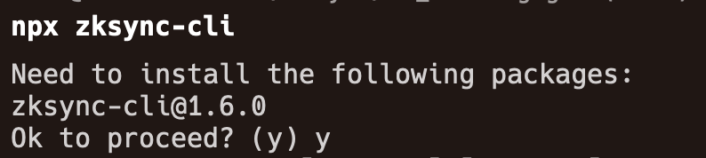
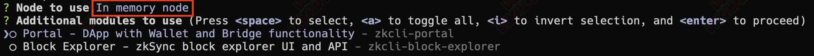
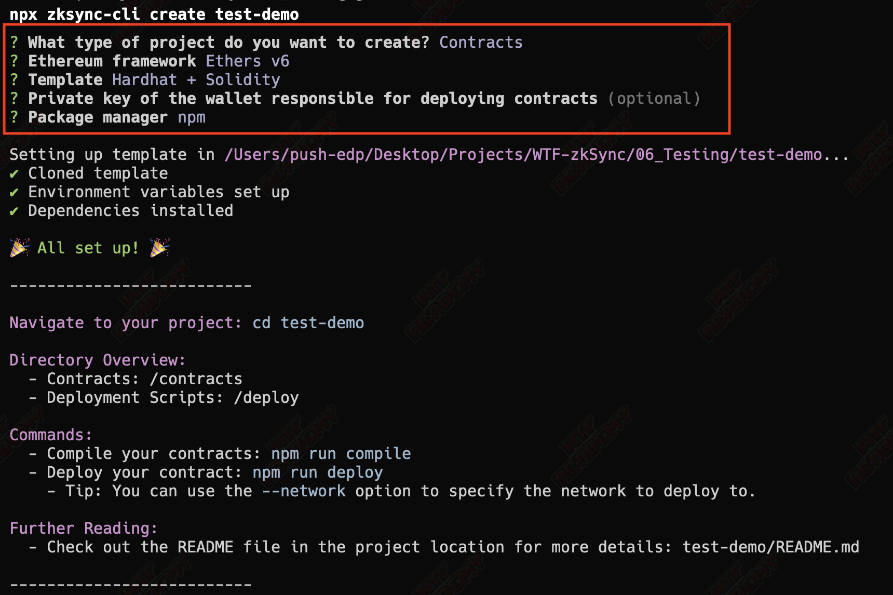
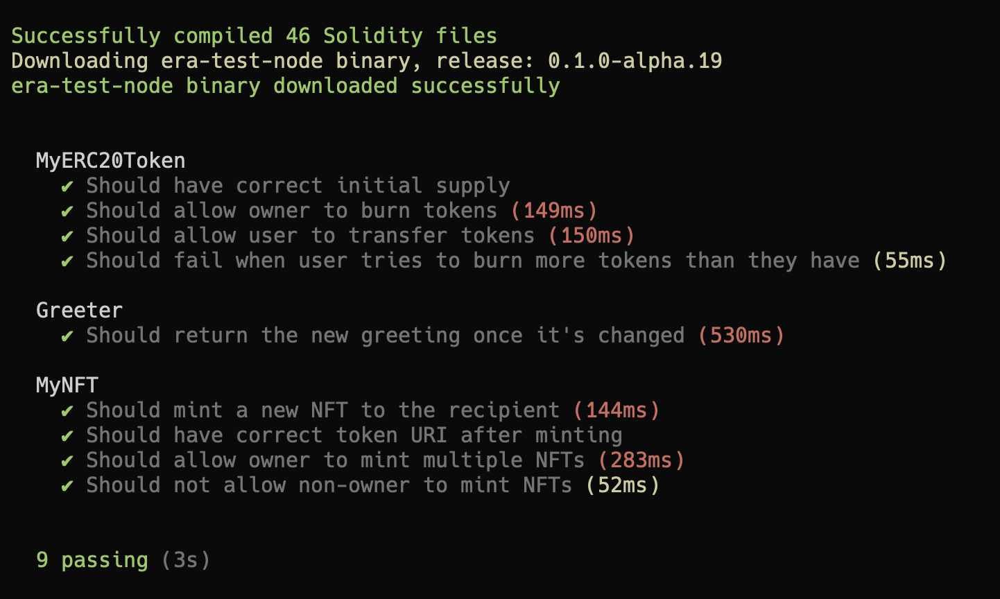
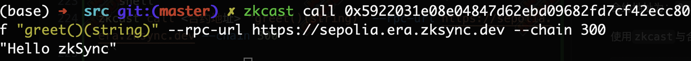

# WTF zkSync 极简入门: 6. 合约测试

这个系列教程帮助开发者入门 zkSync 开发。
推特：[@0xAA_Science](https://twitter.com/0xAA_Science)｜[@WTFAcademy_](https://twitter.com/WTFAcademy_) 

社区：[Discord](https://discord.gg/5akcruXrsk)｜[微信群](https://docs.google.com/forms/d/e/1FAIpQLSe4KGT8Sh6sJ7hedQRuIYirOoZK_85miz3dw7vA1-YjodgJ-A/viewform?usp=sf_link)｜[官网 wtf.academy](https://wtf.academy) 

所有代码和教程开源在 github: [github.com/WTFAcademy/WTF-zkSync](https://github.com/WTFAcademy/WTF-zkSync)

---

在开发 zkSync 合约时，编写测试程序是验证合约逻辑正确性的关键一环。这一讲将引导你了解如何在 zkSync 中编写测试程序。

## 准备工作

在开始 zkSync 的测试之前，先来了解下 evm 智能合约的基础测试，请确保你已经配置好了测试环境。你需要安装 Node.js、NPM 以及 [Hardhat](https://hardhat.org/hardhat-runner/docs/getting-started)，这是一个以太坊开发环境，能够让你编译、部署和测试你的智能合约。

如果你还没有安装 Hardhat，可以通过以下命令安装：

```shell
npm install -D hardhat
```

接下来，创建一个新的 Hardhat 项目：

```shell
npx hardhat
```


按照提示完成项目设置后，你的工作目录下会自动生成一些新目录，比如：`contracts`, `test`。你的基础开发环境就准备完成了。

## 编写智能合约

在 `contracts` 文件夹中创建一个新的 Solidity 智能合约文件 `MyContract.sol`。这里，我们将简单地编写一个存储和更新数字的合约作为例子：

```solidity
// SPDX-License-Identifier: MIT
pragma solidity ^0.8.0;

contract MyContract {
    uint public myNumber;

    function setMyNumber(uint _myNumber) external {
        myNumber = _myNumber;
    }

    function getMyNumber() external view returns (uint) {
        return myNumber;
    }
}
```

## 编写测试程序

测试编写的智能合约是保证其按预期工作的重要步骤。Hardhat 使用 Mocha 测试框架和 Waffle 断言库来编写测试。在 `test` 文件夹中，创建一个新的测试文件 `MyContract.test.js`。

```javascript
const { expect } = require("chai");
const { ethers } = require("hardhat");

describe("MyContract", function () {
  it("Should return the new number once it's changed", async function () {
    const MyContract = await ethers.getContractFactory("MyContract");
    const myContract = await MyContract.deploy();
    await myContract.waitForDeployment();

    const setTx = await myContract.setMyNumber(7);

    // 等待交易完成
    await setTx.wait();

    expect(await myContract.getMyNumber()).to.equal(7);
  });
});
```

这段测试代码初看可能有些复杂，但其步骤可以简单分为：

1. 部署合约。
2. 调用 `setMyNumber` 函数更新状态。
3. 等待函数调用在 `hardhat` 模拟的链环境中运行完成。
4. 调用 `getMyNumber` 来获取最新值，检查是否如我们所预期，`expect` 方法是 [chai](https://www.chaijs.com/api/) 提供的辅助方法，详细使用方法请查阅它的文档。

## 执行测试

一切准备就绪后，你可以通过运行以下命令来执行测试：

```shell
npx hardhat test
```

当测试顺利通过时，你会看到一个绿色的复选框以及测试通过的信息，表明你的合约按预期工作。


## zkSync 相关测试

### 准备工作

在 zkSync 测试中，你需要用到 `zksync-cli` 命令，在第一次使用这个命令时它会问你是否要安装，回答 `y` 即可。



我们将用这个命令来启动一个本地的 zkSync 的运行环境，包括一个临时的 zkSync `In-Memory` 节点，这个节点的运行需要依靠 `docker`，所以你本地必须提前安装好了 `docker`，[下载安装](https://www.docker.com/products/docker-desktop/)。 (`docker` 是一种应用容器，你是第一次接触到它的话，就把它看成虚拟机就行，不需要深入，因为 `zksync-cli` 命令会帮我们屏蔽掉使用细节，有兴趣的朋友，可以自行探索 [docker](https://www.docker.com))

### 启动测试环境

在确保 docker 在正常运行后，使用 `npx zksync-cli dev start` 命令来启动一个运行环境，启动节点类型选择 `In-Memory` 节点，不需要添加任何附加模块。



第一次启动时会先创建一个 docker 镜像，等待运行完成即可，运行完后你的临时节点将在后台运行，你会得到一个本地 zkSync 链的 RPC 连接地址


### 创建测试

使用 `npx zksync-cli create test-demo` 命令可以创建一个名为 `test-demo` 的模板测试项目，命令运行时会询问你要测试类型和要用到的框架，按照自己喜好选择就行了。



这里我将选择 `npm` 作为项目的依赖管理器，使用 `HardHat` + `Solidity` 进行开发测试, `ethers` 库我选择了 v6 版本。

在 `test-demo` 目录下，你会看到很多新的文件夹，和之前的基础测试一样，合约代码文件都在 `contracts` 目录下，需要运行的测试都在 `test` 目录下。

接下来运行以下两行命令来安装好项目依赖的第三方库，和额外添加一个 zkSync 数据的测试工具包

```
npm install
npm install -D @matterlabs/hardhat-zksync-chai-matchers @nomicfoundation/hardhat-chai-matchers @nomiclabs/hardhat-ethers
```

然后在 `hardhat.config.ts` 文件头中还需要添加下面这行代码，用来给 chai 添加对 zkSync 的支持。

```
import "@matterlabs/hardhat-zksync-chai-matchers";
```

最后运行 `npm test` 来启动测试，`test` 目录下的测试文件都将被运行。（第一次启动时会下载 `zksolc` 和 `solc`，若等待下载太久请自行解决网络问题)



## 使用 Foundry-zksync 进行测试

[foundry-zksync](https://github.com/matter-labs/foundry-zksync)是 Foundry 的专门分支，为 zkSync 量身定制。它扩展了 Foundry 在以太坊应用开发方面的能力，以支持 zkSync，允许编译、部署、测试和与 zkSync 上的智能合约进行交互。foundry-zksync 引入了 Foundry 现有 forge 和 cast 工具的 zkforge 和 zkcast 扩展，但专门为 zkSync 使用而设计。

### 准备工作

安装 foundry-zksync 需要以下步骤：

1. 克隆该仓库：

```shell
git clone git@github.com:matter-labs/foundry-zksync.git
```

2. 进入 foundry-zksync 目录并切换到主分支：

```shell
cd foundry-zksync && git checkout main
```

3. 安装 zkForge 和 zkCast：

```shell
cargo install --path ./crates/zkforge --profile local --force --locked
cargo install --path ./crates/zkcast --profile local --force --locked
```

### 创建测试

安装完成后，使用 `zkforge init test-demo` 初始化一个新项目，该操作将设置新 Foundry 项目的基本结构

进入项目目录，运行 `zkforge test` 来执行测试，你会看到测试结果。

或者使用

```shell
zkforge test --match-contract CounterTest --match-test test_Increment
```

通过合约或测试名称进行过滤来运行特定的测试

### 将合约部署到 zkSync sepolia 测试网

在 src 目录下创建一个新的合约文件`Greeter.sol`，内容如下：

```solidity
//SPDX-License-Identifier: Unlicense
pragma solidity ^0.8.0;

contract Greeter {
    string private greeting;

    constructor(string memory _greeting) {
        greeting = _greeting;
    }

    function greet() public view returns (string memory) {
        return greeting;
    }

    function setGreeting(string memory _greeting) public {
        greeting = _greeting;
    }
}
```

进行编译:

```shell
zkforge zkbuild --is-system=true --use 0.8.13 --use-zksolc v1.4.0
```

将智能合约部署上链：

```shell
zkforge zkcreate src/Greeter.sol:Greeter --constructor-args "Hello zkSync" --private-key <你的钱包私钥> --rpc-url https://sepolia.era.zksync.dev --chain 300
```

如图所示，合约部署成功：


合约地址为：`0x5922031e08e04847d62ebd09682fd7cf42ecc80f`

使用`zkcast`与合约进行交互:

```shell
zkcast call <合约地址> "greet()(string)" --rpc-url https://sepolia.era.zksync.dev --chain 300
```

如图所示，调用成功：


## 总结

编写测试程序是智能合约开发中的重要一环，尤其是当你的合约逻辑变得复杂时。本教程简单介绍了如何在 zkSync 合约开发环境中编写和执行测试, 并利用 foundry-zksync 将合约部署到 zkSync 测试网。希望这些内容能帮助你更好地理解 zkSync 的合约测试。
