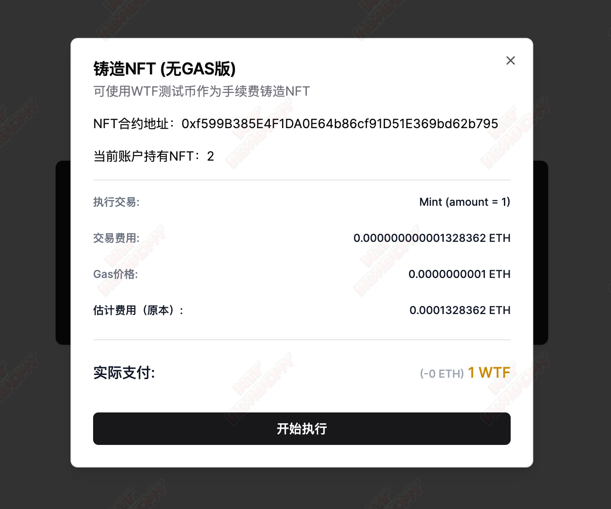

# zkSync Dapp开发教程

在本教程中，我们将会完成：

1. 与已创建的NFT，TOKEN，TOKENPaymaster合约进行交互
2. 了解与使用zkSync基于React技术栈下的开发工具
3. 构建一个集成Paymaster支付的NFT铸造页面，以允许用户使用ERC20 代币支付交易费用



### 先决条件：

1. 获取zkSync Sepolia测试网ETH：[https://learnweb3.io/faucets/zksync_sepolia/](https://learnweb3.io/faucets/zksync_sepolia/)，[https://docs.zksync.io/build/tooling/network-faucets.html](https://docs.zksync.io/build/tooling/network-faucets.html)
2. 了解Paymaster（可查看前面的教程）

### 相关工具：

1. **nextjs**: 项目使用React 和 Nextjs作为前端框架
2. **ethers5**: zkSync与主网相同，都可采用ethers作为主要合约交互工具库使用
3. **zksync-ethers5**: 此库在ethers基础上封装/附加功能，本教程将会采用其完成我们的paymaster集成到铸造NFT中。(注：若不使用zkSync独特的功能如抽象账户，Paymaster等与ethers无异,直接使用ethers即可，不影响以往主网开发使用工具的流程)
4. **web3modal**: 快捷美观的钱包工具库，提供连接钱包的集成UI和相应的逻辑

### 配置项目：

1. 下载基础项目和安装依赖
    
    ```jsx
    git clone https://github.com/WTFAcademy/WTF-zkSync.git
    cd WTF-zkSync/07_DAPP/template
    pnpm i / yarn / npm install
    ```
    
2. 目录结构：
    
    常见的nextjs目录结构，我们主要入口是`(main)/page.tsx` 然后划分两个step：连接钱包，铸造NFT，同时将所有合约相关逻辑抽到hook中完成。
    
    ```jsx
    zksync-nft-demo
    ├── app
    │   ├── (main)
    │   │   ├── page.tsx
    │   │   ├── step-connect-wallet.tsx
    │   │   └── step-mint.tsx
    │   ├── globals.css
    │   ├── layout.tsx
    │   └── providers.tsx
    ├── components
    │   ├── checkout.tsx
    │   ├── connect-button.tsx
    │   ├── icons.tsx
    │   ├── mint-nft-modal.tsx
    │   ├── mint-token-modal.tsx
    │   └── ui
    ├── constants
    │   └── contract.ts
    ├── context
    │   └── web3-modal.tsx
    ├── hooks
    │   ├── use-nft.ts
    │   ├── use-paymaster.ts
    │   └── use-token.ts
    ├── lib
    │   └── utils.ts
    ```
    

### 合约简单介绍：

合约都已开源，可以在[https://sepolia.explorer.zksync.io/](https://sepolia.explorer.zksync.io/)找到

1. [NFT合约](https://sepolia.explorer.zksync.io/address/0xf599B385E4F1DA0E64b86cf91D51E369bd62b795#contract):   对外暴露mint接口给用户执行，无限制
    
    ```jsx
     function mint(address recipient, string memory stoneName) public {
        require(bytes(stoneName).length > 0, "stoneName must not be empty");
        require(recipient != address(0), "recipient must not be the zero address");
    
        _safeMint(recipient, tokenId);
        _ownedTokens[recipient].push(tokenId);
        _setTokenURI(tokenId, stoneName);
        tokenId++;
      }
    ```
    
2. [Token合约](https://sepolia.explorer.zksync.io/address/0x9Aa5e0Bc9e214050dCaB9510886Ba425c8F2d23e#contract):   普通ERC20，对外暴露mint，无限制
    
    ```solidity
    function mint(address _to, uint256 _amount) public returns (bool) {
       _mint(_to, _amount);
       return true;
    }
    ```
    
3. [Paymaster合约](https://sepolia.explorer.zksync.io/address/0x97CB051f8fF92e7936014a29623f8CD5aFA2A825#contract):  ERC20交易支付方案，允许前者token的持有者支付token作为gas手续费支付

### 前端开发

1. 启动项目后，我们会看到一个连接钱包和一个初步完成的铸造界面
    
    
    
    
    
2. **连接钱包**
    
    每个Dapp应用最开始肯定就是连接钱包了，我们这边将采用web3modal + ethers5来完成这个步骤：
    
    - 首先进入`context/web3-modal.tsx` 完成web3modal的初步构建，可以参考[链接](https://docs.walletconnect.com/web3modal/nextjs/about?platform=ethers)，注意需要前往https://cloud.walletconnect.com注册一个projectid
        
        ```jsx
        'use client'
        
        import { createWeb3Modal, defaultConfig } from '@web3modal/ethers5/react'
        
        // 1. Get projectId at https://cloud.walletconnect.com
        const projectId = '' // 自行申请一个
        
        // 2. Set chains
        export const zkSyncSepoliaTestnet = {
            chainId: 300,
            name: "zkSync Sepolia Testnet",
            currency: "ETH",
            explorerUrl: "https://sepolia.explorerzksync.io/",
            rpcUrl: "https://sepolia.era.zksync.dev",
        }
        
        // 3. Create modal
        const metadata = {
            name: 'Web3Modal',
            description: 'Web3Modal ZkSync Example',
            url: 'https://web3modal.com', // origin must match your domain & subdomain
            icons: ['https://avatars.githubusercontent.com/u/37784886']
        }
        
        export const {getWalletProvider} = createWeb3Modal({
            ethersConfig: defaultConfig({ metadata }),
            chains: [zkSyncSepoliaTestnet],
            projectId,
            enableAnalytics: true // Optional - defaults to your Cloud configuration
        })
        
        export function Web3ModalProvider({ children }: { children: React.ReactNode }) {
            return children
        }
        ```
        
    - 将其引用到在最上层使用，进入`app/providers.tsx`
        
        ```jsx
        'use client'
        
        import { Web3ModalProvider } from '@/context/web3-modal';
        import React, { ReactNode } from 'react'
        import { QueryClient, QueryClientProvider } from 'react-query';
        
        const queryClient = new QueryClient()
        
        export default function Providers({ children }: { children: ReactNode }) {
            return (
                <QueryClientProvider client={queryClient}>
                    <Web3ModalProvider>
                        {children}
                    </Web3ModalProvider>
                </QueryClientProvider>
            )
        }
        ```
        
    - 入口我们自己定义一下连接按钮样式，再使用`useWeb3Modal`的`open`打开连接钱包弹窗进行钱包连接，切换网络等操作，同时使用useWeb3ModalAccount给出的状态`adress`, `isConnected`在UI层做出一些交互优化展示
        
        ```tsx
        const StepConnectWallet = ({next}: {next: () => void}) => {
            const { open } = useWeb3Modal();
            const {address, isConnected} = useWeb3ModalAccount();
        
            const handleClick = () => {
                open().catch(console.error);
            }
        
            useEffect(() => {
                if (isConnected) {
                    next();
                }
            }, [isConnected]);
        
            return (
                <div className="px-10 py-8 bg-[#ffffff] rounded-lg shadow flex items-center justify-center">
                    <button className="rounded-lg border-px border-border" onClick={handleClick}>
                        <div className="flex items-center gap-3 justify-center">
                            <Icons.wallet className="w-4 h-4" />
                            <span>{isConnected ? (
                                <span className="flex items-center gap-2">
                                    <span>已连接</span>
                                    <span className="text-[#000000] text-sm">{truncate(address!)}</span>
                                </span>
                            ) : "连接钱包"}</span>
                        </div>
                    </button>
                </div>
            )
        }
        ```
        
3. 此时已经完成了我们钱包的逻辑处理，接下来我们要深入合约交互逻辑处理，我们要做的就是基于合约完成3个hooks：useToken, usePaymaster, useNFT
    - **usePaymaster**
        - 我们将会在此hook中完成paymaster的部分参数组装，以便快速运用到其他的合约调用中，并且获取paymaster余额，来告知用户是否仍然可以继续使用token替代gas支付， 以下关键代码中我们采用type为`ApprovalBased` 来完成Token的逻辑处理，并且设定`minimalAllowance`为指定值，此处表示支付的Token数量用于替换手续费支出，这里实际上会更具具体的需求还给出动态的值，我们为了简单处理每笔交易都只需要支出1个token即可：
            
            ```jsx
            const paymasterParams = utils.getPaymasterParams(PAYMASTER_ADDRESS, {
                    type: "ApprovalBased",
                    token: TOKEN_ADDRESS,
                    // set minimalAllowance as we defined in the paymaster contract
                    minimalAllowance: ethers.utils.parseEther("1"),
                    // empty bytes as testnet paymaster does not use innerInput
                    innerInput: new Uint8Array(),
            });
            ```
            
        - 完整代码：
            
            ```jsx
            const usePaymaster = () => {
                const { isConnected } = useWeb3ModalAccount()
                const { walletProvider } = useWeb3ModalProvider()
            
                const {isLoading, data: paymasterBalance} = useQuery("paymaster", async () => {
                    const ethersProvider = new Web3Provider(walletProvider!)
                    const balance = await ethersProvider.getBalance(PAYMASTER_ADDRESS);
                    return ethers.utils.formatEther(balance);
                }, {
                    enabled: isConnected,
                    refetchInterval: 3000
                })
            
                const paymasterParams = utils.getPaymasterParams(PAYMASTER_ADDRESS, {
                    type: "ApprovalBased",
                    token: TOKEN_ADDRESS,
                    // set minimalAllowance as we defined in the paymaster contract
                    minimalAllowance: ethers.utils.parseEther("1"),
                    // empty bytes as testnet paymaster does not use innerInput
                    innerInput: new Uint8Array(),
                });
            
                return {
                    paymasterBalance,
                    isLoading,
                    customData: {
                        gasPerPubdata: utils.DEFAULT_GAS_PER_PUBDATA_LIMIT,
                        paymasterParams,
                    }
                }
            }
            ```
            
    - **useToken**
        - 该合约我们首先需要完成获取token余额，mint用于支付替代手续费，参考代码内容：
            
            ```jsx
            const useToken = () => {
                const { isConnected, address } = useWeb3ModalAccount()
                const { walletProvider } = useWeb3ModalProvider()
            
                const { customData } = usePaymaster();
            
                const contract = useMemo(() => {
                    if (!isConnected) return null;
                    const ethersProvider = new Web3Provider(walletProvider!)
                    const signer = ethersProvider.getSigner();
                    return new Contract(TOKEN_ADDRESS, TOKEN_ABI, signer);
                }, [isConnected, address])
            
                const { data: tokenBalance, refetch: refetchToken } = useQuery(
                    ["token", address],
                    async () => {
                        const erc20Contract = contract!;
                        const balance = await erc20Contract.balanceOf(address);
                        return ethers.utils.formatEther(balance).toString();
                    },
                    {
                        enabled: isConnected,
                        refetchInterval: 0
                    }
                )
            
                const { data: mintTx, isLoading: isMintLoading, mutateAsync: mint } = useMutation(
                    ["mint", address],
                    async () => {
                        const erc20Contract = contract!;
                        const tx = await erc20Contract.mint(address, ethers.utils.parseEther("1000"), {
                            customData: ethers.utils.parseEther(tokenBalance!) > ethers.utils.parseEther("1") ? customData : undefined
                        });
                        await tx.wait();
                        return tx;
                    },
                    {
                        onSuccess: () => {
                            refetchToken();
                            toast.success("mint 1000 token success");
                        },
                        onError: (error: any) => {
                            console.log(error);
                            toast.error(error.data.message);
                        }
                    }
                )
            
                return {
                    tokenBalance,
                    refetchToken,
                    mint,
                    mintTx,
                    isMintLoading,
                }
            }
            ```
            
        - 在Paymaster调用的过程中，是需要用户token授权Paymaster合约才可调用，我们需要完善增加授权逻辑
            
            ```jsx
            // ...其他省略
            
            const {data: allowance, refetch: refetchAllowance} = useQuery(["tokenAllowance", address], async () => {
                const erc20Contract = contract!;
                const allowance = await erc20Contract.allowance(address, customData.paymasterParams.paymaster);
                return allowance;
            }, {
                enabled: isConnected,
                refetchInterval: 0
            })
            
            const { 
                data: approvePaymasterTx, 
                isLoading: isApprovePaymasterLoading, 
                mutateAsync: approvePaymaster
            } = useMutation("approve", async () => {
                const erc20Contract = contract!;
                const tx = await erc20Contract.approve(
                    PAYMASTER_ADDRESS,
                    ethers.constants.MaxUint256
                );
                await tx.wait();
                return tx;
            }, {
                onSuccess: () => {
                    toast.success("approve paymaster success");
                    refetchAllowance();
                }
            })
            
            return {
            	// ...省略其他
            	isAllowancePaymaster: allowance?.gte(ethers.utils.parseEther("1")),
              approvePaymaster,
              isApprovePaymasterLoading,
              approvePaymasterTx,
            }
            ```
            
        - 我们期望页面能够展示Token Mint环节产生的Gas消耗情况，以及利用余额判断是否满足paymaster调用（paymaster限制了最少需要1个token），我们增加两个内容：
            
            ```jsx
            const getTokenMintEstimate = async () => {
                const ethersProvider = new Web3Provider(walletProvider!)
                const erc20Contract = contract!;
                const gasEstimate = await erc20Contract.estimateGas.mint(address, ethers.utils.parseEther("1000"));
                const gasPrice = await ethersProvider.getGasPrice();
                const cost = gasPrice.mul(gasEstimate);
            
                return {
                    gas: ethers.utils.formatEther(gasEstimate).toString(),
                    gasPrice: ethers.utils.formatEther(gasPrice).toString(),
                    cost: ethers.utils.formatEther(cost).toString()
                }
            }
            
            return {
            	//...
            	getTokenMintEstimate,
            	canNonGas: tokenBalance ? ethers.utils.parseEther(tokenBalance!) > ethers.utils.parseEther("1") : false
            }
            ```
            
    - **useNFT**
        - NFT合约中我们需要完成NFT持有数量查询，mint NFT逻辑，同时mint时，我们集成了paymaster的支付手段，首先我们需要关注的是我们采用的是zksync-ethers的`Contract`和`Web3Provider` 这是官方扩展的类，里面涉及了抽象账户，Paymaster逻辑等zksync独特的功能，我们这边需要用到paymaster，故我们不能直接采用ethers里面构建合约；其次我们在调用合约的时候传入`customData`即可，这里我们在前面`usePaymaster`中已经提及，这是调用paymaster的关键：
            
            ```jsx
            // 截取代码组合，不可运行
            import { Contract, Web3Provider } from "zksync-ethers";
            import { ethers } from "ethers";
            
            const contract = useMemo(() => {
                 if (!isConnected) return null;
                 const ethersProvider = new Web3Provider(walletProvider!)
                 const signer = ethersProvider.getSigner();
                 return new Contract(NFT_ADDRESS, NFT_ABI, signer);
            }, [isConnected, address])
            
            async () => {
              if (!contract) return null;
              const tx = await contract.mint(address, "Space Stone", {
                  customData: canNonGas ? customData : undefined
              });
              await tx.wait();
              return tx;
            }
            ```
            
        - 将其完善到hook中：
            
            ```jsx
            const useNft = () => {
                const { isConnected, address } = useWeb3ModalAccount()
                const { walletProvider } = useWeb3ModalProvider()
            
                const { canNonGas } = useToken();
                const { customData } = usePaymaster();
            
                const contract = useMemo(() => {
                    if (!isConnected) return null;
            
                    const ethersProvider = new Web3Provider(walletProvider!)
                    const signer = ethersProvider.getSigner();
                    return new Contract(NFT_ADDRESS, NFT_ABI, signer);
                }, [isConnected, address])
            
                const { data: nftBalance, refetch } = useQuery(["nftBalance", address], async () => {
                    if (!contract) return null;
                    const balance = await contract.balanceOf(address);
                    return balance.toString();
                }, {
                    enabled: isConnected,
                    refetchInterval: 0
                })
            
                const {
                    data: mintTx,
                    isLoading: isMintLoading,
                    mutateAsync: mint
                } = useMutation(["mintNft", address], async () => {
                    if (!contract) return null;
                    const tx = await contract.mint(address, "Space Stone", {
                        customData: canNonGas ? customData : undefined
                    });
                    await tx.wait();
                    return tx;
                }, {
                    onSuccess: () => {
                        toast.success("NFT minted successfully");
                        refetch();
                    },
                    onError: (err: any) => {
                        toast.error(err.message);
                    }
                })
            
                return {
                    nftBalance,
                    mintTx,
                    isMintLoading,
                    mint,
                }
            }
            ```
            
        - 当然我们也要与token类似，为了辅助我们页面展示mint NFT消耗Gas的情况，我们也加入了getNFTMintEstimate计算，在hook中增加函数
            
            ```jsx
            
            const getNFTMintEstimate = async () => {
                const ethersProvider = new Web3Provider(walletProvider!)
                const nftContract = contract!;
                const gasEstimate = await nftContract.estimateGas.mint(address, "Space Stone");
                const gasPrice = await ethersProvider.getGasPrice();
                const cost = gasPrice.mul(gasEstimate);
            
                return {
                    gas: ethers.utils.formatEther(gasEstimate).toString(),
                    gasPrice: ethers.utils.formatEther(gasPrice).toString(),
                    cost: ethers.utils.formatEther(cost).toString()
                }
            }
            ```
        
4. 前面我们已经完了所有合约交互相关的核心逻辑，接下来我们要把他们运用到页面中，让我们的页面更加完善，我们需完成一下内容，样式部分我已经在模版中完成，只需要使用hooks填充数据即可：
    - 打开`app/(main)/step-mint.tsx` 完成初始数据加载
           
        ```jsx
        const StepMint = () => {
            const { paymasterBalance } = usePaymaster();
            const {tokenBalance} = useToken();
        
            return (
                <div className="px-10 py-8 bg-[#1E1E1E] rounded-lg shadow text-[#ffffff] flex flex-col gap-4">
                    <div className="text-[#29BC38] font-bold text-xl">WTF zkSync NFT Mint</div>
                    <div className="space-y-3">
                        <div className="space-x-1">
                            <span className="text-gray-400">Paymaster 余额：</span>
                            <span>{paymasterBalance} ETH</span>
                        </div>
                        <div className="space-x-1">
                            <span className="text-gray-400">Paymaster 指定Token余额: </span>
                            <span>{tokenBalance}</span>
                            <MintTokenModal />
                        </div>
                        <div className="space-x-1">
                            <span className="text-gray-400">NFT铸造：</span>
                            <MintNFTModal />
                        </div>
                    </div>
                </div>
            )
        }
        ```
        
    - 完成`components/mint-token-modal`逻辑，以铸造满足Paymaster使用的token金额
        
        ```jsx
        // 1. 使用 useToken hook 获取 tokenBalance,mint等执行函数和状态
        // 2. 计算fee, GasPrice, 实际支出
        // 3. 使用Checkout组件展示支付信息
        // 4. 新增执行和授权按钮
        
        const MintTokenModal = () => {
            const [openModal, setOpenModal] = useState<boolean>(false);
            const {
                tokenBalance,
                getTokenMintEstimate,
                mint,
                isMintLoading,
                canNonGas,
                isAllowancePaymaster,
                approvePaymaster,
                isApprovePaymasterLoading
            } = useToken();
        
            const {
                data: tokenMintEstimate,
                isLoading: isTokenMintEstimateLoading
            } = useQuery("tokenMintEstimate", getTokenMintEstimate, {
                enabled: openModal
            })
        
            return (
                <Dialog open={openModal} onOpenChange={setOpenModal}>
                    <DialogTrigger>
                        <a className="text-blue-600">Mint</a>
                    </DialogTrigger>
                    <DialogContent>
                        <DialogHeader>
                            <DialogTitle>领取支付代币 {canNonGas && "(无GAS版)"}</DialogTitle>
                            <DialogDescription>用于支付手续费的代币</DialogDescription>
                        </DialogHeader>
                        <div className="flex flex-col gap-4 mb-4">
                            <div className="text-sm">代币合约地址：{TOKEN_ADDRESS}</div>
                            <div className="text-sm">当前账户代币余额：{tokenBalance || 0} WTF</div>
                            <Checkout
                                gas={tokenMintEstimate?.gas}
                                gasPrice={tokenMintEstimate?.gasPrice}
                                cost={tokenMintEstimate?.cost}
                                nonGas={canNonGas}
                                transaction="Mint (amount = 1000 WTF)"
                            />
                        </div>
                        <DialogFooter>
                            {
                                isAllowancePaymaster ? (
                                    <Button
                                        size="sm"
                                        className="w-full"
                                        disabled={isMintLoading}
                                        onClick={() => mint()}
                                    >开始执行</Button>
                                ) : (
                                    <Button
                                        size="sm"
                                        className="w-full"
                                        disabled={isApprovePaymasterLoading}
                                        onClick={() => approvePaymaster()}
                                    >授权代币作为手续费支付</Button>
                                )
                            }
                        </DialogFooter>
                    </DialogContent>
                </Dialog>
            )
        }
        ```
        
    - 在 `components/mint-nft-modal` 中使用useNFT完成逻辑交互

         ```jsx
         // 1. 使用 useNft hook 获取 nftBalance,mint等执行函数和状态
         // 2. 计算fee, GasPrice, 实际支出
         // 3. 使用Checkout组件展示支付信息
         // 4. 新增执行按钮  
         
      
         const MintNFTModal = () => {
             const [openModal, setOpenModal] = useState<boolean>(false);
             const {
                 nftBalance,
                 getNFTMintEstimate,
                 mint,
                 isMintLoading
             } = useNft();
         
             const { canNonGas } = useToken();
         
             const {
                 data: nftMintEstimate,
                 isLoading: isTokenMintEstimateLoading
             } = useQuery("nftMintEstimate", getNFTMintEstimate, {
                 enabled: openModal
             })
         
             return (
                 <Dialog open={openModal} onOpenChange={setOpenModal}>
                     <DialogTrigger>
                         <a className="text-blue-600 cursor-pointer">Mint</a>
                     </DialogTrigger>
                     <DialogContent>
                         <DialogHeader>
                             <DialogTitle>铸造NFT {canNonGas && "(无GAS版)"}</DialogTitle>
                             <DialogDescription>可使用WTF测试币作为手续费</DialogDescription>
                         </DialogHeader>
                         <div className="flex flex-col gap-4 mb-4">
                             <div className="text-sm">NFT合约地址：{NFT_ADDRESS}</div>
                             <div className="text-sm">当前账户持有NFT：{nftBalance || 0}</div>
                             <Checkout
                                 gas={nftMintEstimate?.gas}
                                 gasPrice={nftMintEstimate?.gasPrice}
                                 cost={nftMintEstimate?.cost}
                                 nonGas={canNonGas}
                                 transaction="Mint (amount = 1)"
                             />
                         </div>
                         <DialogFooter>
                             <Button
                                 size="sm"
                                 className="w-full"
                                 disabled={isMintLoading}
                                 onClick={() => mint()}
                             >开始执行</Button>
                         </DialogFooter>
                     </DialogContent>
                 </Dialog>
             )
         }
         ```
        
5. 此时我们已完成了前端开发，我们可以去页面中开始尝试paymaster的神奇吧！体验无Gas铸造NFT的过程。
    1. 导航到 `http://localhost:3000` 并刷新页面。单击“连接钱包”链接您的 MetaMask 帐户。确保你持有zksync Sepolia测试网ETH
    2. 查看paymaster余额，如果不够可以捐赠一些以满足正常是的运转
    3. 铸造Token用于NFT铸造的支付
    4. 开始NFT铸造，可以看到右侧一个签名，完成后即可满足最终的交易执行成功