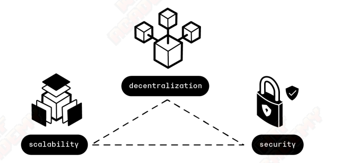
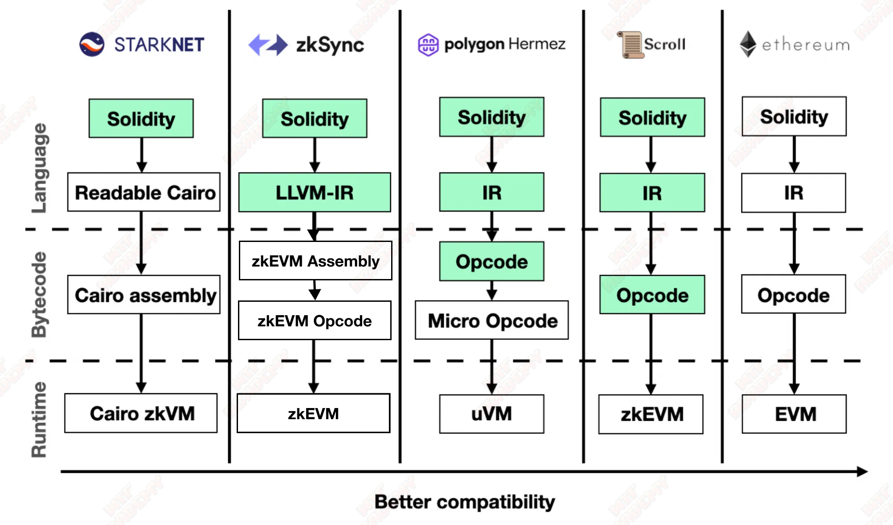
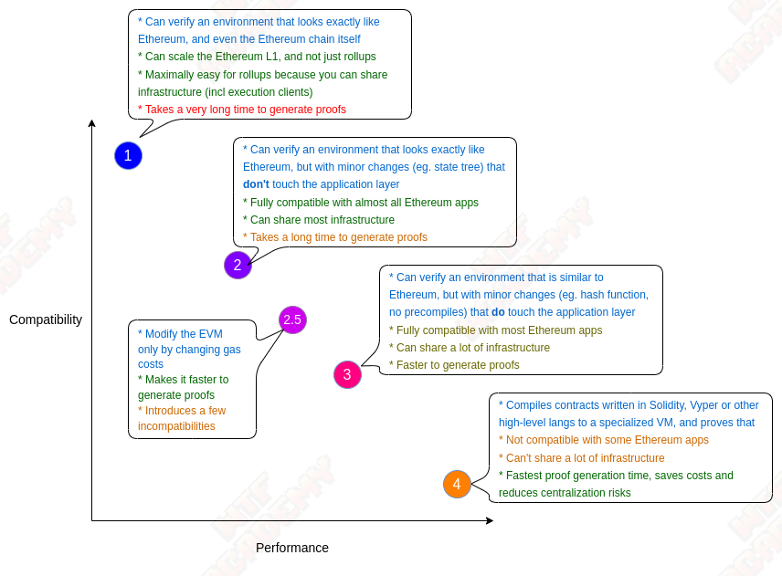
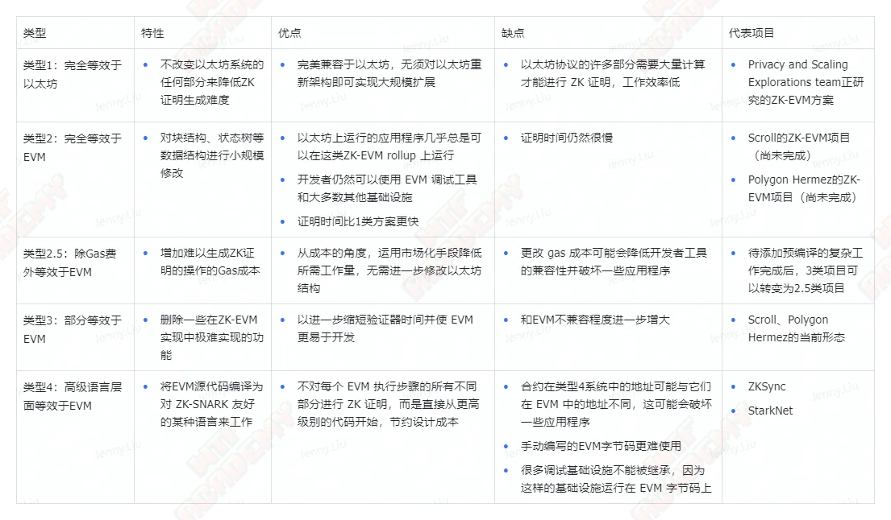

In this lecture, we will introduce what L2 is and its types.

## 1. What is L2?

L2 (Layer 2, Layer 2 network) is an expansion solution for Ethereum. It is an independent blockchain that extends Ethereum and inherits the security guaranteed by Ethereum.

### 1.1 What is L1?

L1, the first layer of the network, refers to the underlying blockchain infrastructure. They are the cornerstone of the entire blockchain ecosystem, providing the necessary infrastructure and security for upper-layer applications and expansion solutions. Ethereum and Bitcoin are both typical first-layer network blockchains because they each provide an independently operating, fully functional blockchain system, including transaction processing, data storage, and network consensus mechanisms.

Key features and capabilities of L1 networks include:

- **Node Operator Network**: Composed of globally distributed computers or nodes, these nodes are responsible for maintaining and verifying the transactions and status of the network, ensuring the decentralization and security of the network.
- **Block Producer Network**: Specific nodes (such as miners or validators) are responsible for generating new blocks that contain records of all transactions performed on the network.
- **The blockchain itself and its transaction data history**: As a growing chain data structure, the blockchain records the history of all transactions and state changes from the creation of the network to the present.
- **Network Consensus Mechanism**: Defines how nodes in the network reach consensus, verify and confirm transactions, and how to add new blocks to the blockchain. Different L1 networks may use different consensus mechanisms, such as Proof of Work (PoW), Proof of Stake (PoS), etc.

### 1.2 Impossible Triangle

There is an "impossible triangle" in traditional monetary theory, that is, a country cannot achieve monetary policy independence, exchange rate stability, and free capital flow at the same time. At most, it can only meet two goals at the same time while giving up the other goal.

Similarly, the current blockchain technology also has the "**Impossible Triangle**", that is, it cannot simultaneously achieve **Scalability**, **Decentralization**, and **Security ( Security)**, you can only get two of the three.

- Scalability: can handle a large number of transactions per second.
- Decentralization: There are a large number of nodes participating in block production and verifying transactions.
- Security: Gaining majority control of a network is very costly.

At present, many blockchains will make trade-offs among the three. For example, Ethereum and Bitcoin are more concerned about decentralization and security. Some new public chains focus more on scalability and security.

Starting with the creation of Bitcoin, all the way to the emergence of the Crypto Kitties game on the Ethereum network. The most criticized aspect of mainstream public chain projects is the low TPS. Ethereum’s current TPS is completely unable to provide real-time and stable support for most applications. This is in sharp contrast to the current Internet industry’s business of tens of thousands of TPS.

### 1.3 Expansion plan

For Ethereum, plans for Ethereum expansion have continued to emerge in the past few years. In addition to the Rollup technology we talked about in Part 2, other mainstream solutions are as follows:

- On-chain expansion:
   - Sharding technology: The word Sharding originally comes from the term database, which means dividing a large database into many smaller and more manageable parts, so as to achieve more efficient interaction. Blockchain sharding refers to sharding the blockchain network to increase its scalability. According to the latest Ethereum 2.0 specification, the Ethereum blockchain will be divided into 1024 shard chains, which also means that Ethereum’s TPS will increase by more than 1000 times. However, the current Sharding solution still has shortcomings in cross-shard communication, fraud identification, random allocation and election security.
- Off-chain expansion:
   - State Channel: refers to "off-chain" technology used to perform transactions and other state updates. However, transactions occurring within a state channel remain highly secure and unchangeable. If any issues arise, we can still fall back to the stable version identified in on-chain transactions.
   - Sidechain technology: The side chain is a chain parallel to the main chain. The verifier on the side chain submits the latest status of a chain to the smart contract on the main chain. This is a type of system that continues to advance. Side chains usually use efficient consensus algorithms such as PoA (Proof-of-Authority) and PoS (Proof of Stake). Its advantage is that the code and data are independent from the main chain and does not increase the burden on the main chain. Its disadvantage is that its security is weak, not centralized enough, and it cannot provide censorship resistance, finality and fund ownership guarantees.

### 1.4 L2

L2 (second layer) solutions on top of L1 networks, such as Rollups and Lightning Network, aim to increase transaction processing speed, Reduce transaction costs and improve the scalability of the entire network.

These L2 projects take advantage of the security and data immutability of the L1 network by publishing transaction data to the underlying L1 network (such as Ethereum) to achieve efficient transaction processing on the L2 layer. In addition, the L1 network also provides data availability and ultimate security for the L2 solution, allowing transactions conducted on the L2 network to be confirmed and traced back to the L1 network for verification when needed.

## 2. Rollup

Rollup technology is currently the most mainstream L2 expansion solution. As the name suggests, Rollup is to roll up a bunch of transactions into one transaction. All nodes that receive this transaction only verify the execution results, but not the logic. Therefore, the gas fee required for a rollup transaction will be much smaller than the total transaction gas fee, and TPS (transactions per second) will also increase.

Rollup technology is mainly divided into two categories:

1. Optimistic Rollup

Optimistic Rollup (optimistic Rollup protocol) adopts a fraud proof method, that is, it remains optimistic about all Rollup blocks published on the chain and assumes that they are valid. It only provides evidence if fraud occurs. The advantage of Optimistic Rollup is that it can seamlessly port solidity contracts on native Layer1 to Layer2, thereby maximizing the R&D experience of technical personnel. Currently, mainstream solutions include Optimism and Arbitrum.

2.ZK-Rollup

ZK-Rollup is a Layer 2 expansion solution based on zero-knowledge proof. It adopts the validity verification method (VP). By default, all transactions are dishonest and will only be accepted if they pass validity verification. ZK-Rollup performs complex calculations and proof generation off-chain, and performs proof verification and stores part of the data on-chain to ensure data availability. Current mainstream solutions include zkSync, StarkNet, Scroll, Polygon Hermez, etc.

**In the mid to long term, as ZK-SNARK technology improves, ZK rollups will win in all use cases. **— Vitalik Buterin

## 3. Zero-knowledge proof

**Zero-knowledge proof, abbreviated as ZKP**, was originally written by S. Goldwasser, S. Micali and C. Rackoff in the 1985 paper ["Knowledge Complexity of Interactive Proof Systems"] (https: //people.csail.mit.edu/silvio/Selected%20Scientific%20Papers/Proof%20Systems/The_Knowledge_Complexity_Of_Interactive_Proof_Systems.pdf) proposed, **refers to the prover being able to use it without providing any useful information to the verifier. The verifier believes that a certain assertion is correct. **

**nature**

- Completeness: As long as the assertion is correct, the prover can convince the verifier of the assertion. That is: it cannot be true or false.
- Plausibility: If the assertion is false, then the cheating prover cannot convince the verifier of the assertion. That is: what is false cannot be true.
- Zero-knowledge: The interaction of the protocol only reveals whether the assertion is correct or not, without revealing any other information.

**What are the applications of zero-knowledge proofs?**

- Substantiate claims regarding private data
   - Prove that someone's account balance is more than 100 million without exposing the account balance. For example, the previous FTX thunderstorm sounded the alarm for users. Exchanges can prove to users that their reserves are sufficient through zero-knowledge proof.
   - Match DNA without exposing DNA data
- Anonymous authentication
   - Prove that the requester has access to certain resources without revealing their identity
   - Prove that a person belongs to an identity group without revealing which one
- Pay anonymously
   - Pay taxes without disclosing income
- Outsourced calculations
   - Ethereum expansion technology ZK-Rollup can be understood as a kind of outsourcing calculation, which puts the calculation process off-chain and puts the results on the chain for verification.

## 4. EVM compatibility of zk Rollup

ZK-Rollup was criticized in the early days because it was not compatible with EVM and could not support smart contract functions. For example, zkSync 1.0 (Lite), the main payment method for early Gitcoin donations, could only support basic functions such as transfers. At the same time, since different ZK applications have various dedicated circuits, they cannot call each other and the combinability is poor. Therefore, the market is in urgent need of ZK-Rollup that can support Ethereum smart contracts, and the key threshold is a virtual machine that can support zero-knowledge proofs. zk-rollups only started supporting Ethereum dApps with the introduction of the EVM-compatible zkVM.

  
 Credit: Zhangye@scroll 

Since zkEVM does not have a unified design standard, each project team has designed its own solution based on the trade-off between EVM compatibility and ZK support from different perspectives. Currently, there are basically two ideas:

1. Support at the programming language level, customize EVM opcodes, extract ZK-friendly operations to redesign new virtual machines with different architectures, and compile Soilidity into new virtual machine opcodes through a compiler
2. Bytecode level support, supporting native EVM opcodes

For the first strategy, since it is not constrained by the original EVM instruction set, the code can be compiled more flexibly into an instruction set that is more friendly to zero-knowledge proofs, and it also gets rid of the difficulty of being compatible with all EVM original instruction sets. And heavy work.

For the second strategy, since it fully supports the existing instruction set of EVM and uses the same compiler as EVM, it is naturally fully compatible with the existing ecosystem and development tools, and it also better inherits Ethereum’s security model.

The first idea is more flexible and has a smaller workload, but requires extra effort in adaptation; the second idea has a relatively larger workload, but has better compatibility and higher security.

In Vitalik's blog post, he divides zkEVM into several types. Among them, Type 1 is to develop zkEVM directly on Ethereum. This development is too complicated and currently too inefficient. The Ethereum Fund is currently studying it. Type 2, Type 2.5 and Type 3 are the EVM equivalents of zkEVM, Scroll and Polygon Hermez are currently in the Type 3 stage, working towards Type 2.5 and even Type 2. Type 4 is a high-level language compatible zkEVM, including zkSync and Starknet. There are no good or bad types, and there is no universal standard for zkEVM.

**Theoretically, Ethereum does not need to standardize on a single zkEVM implementation for L1; different clients can use different proofs, so we continue to benefit from code redundancy.** — Vitalik Buterin

## 5. Summary

In this lecture, we introduced the basic knowledge of Layer 2 (L2) and its role in Ethereum expansion, and discussed in depth the mainstream rollup technology and zkEVM. In the next lecture, we will introduce the zkSync Era layer 2 network in detail.
