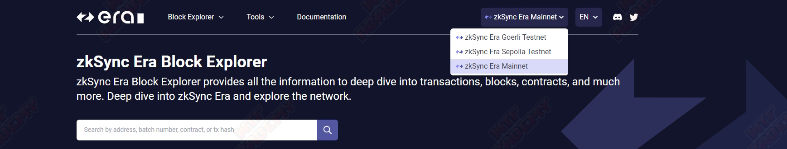
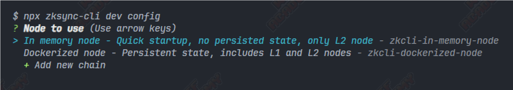
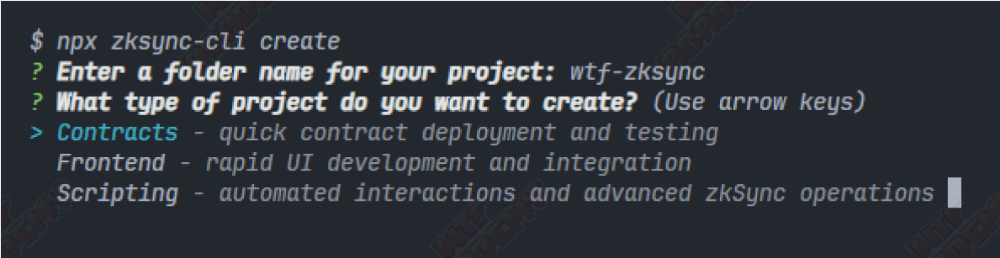
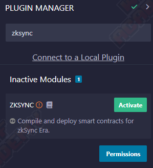
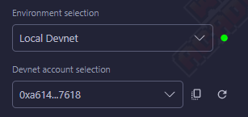

# WTF zkSync: 4. Development tools

This series of tutorials aim to onboard developers to zkSync ecosystem.

Twitter: [@0xAA_Science](https://twitter.com/0xAA_Science)｜[@WTFAcademy_](https://twitter.com/WTFAcademy_)

Community: [Discord](https://discord.gg/5akcruXrsk)｜[WeChat Group](https://docs.google.com/forms/d/e/1FAIpQLSe4KGT8Sh6sJ7hedQRuIYirOoZK_85miz3dw7vA1-YjodgJ-A/viewform?usp=sf_link) |[Official website wtf.academy](https://wtf.academy) 

All codes and tutorials are open source on Github: [github.com/WTFAcademy/WTF-zkSync](https://github.com/WTFAcademy/WTF-zkSync)

---

In this lecture, we will introduce the zkSync ecosystem and some commonly used tools.

## Ecology & Tools

### 1. Blockchain browser

[zkSync Era Block Explorer](https://explorer.zksync.io/)

`zkSync Era Block Explorer` provides all transactions, blocks, contracts and other information on the zkSync network. You can switch between different networks in the drop-down menu in the upper right corner.



### 2. zkSync faucet

[Chainstack Faucet](https://faucet.chainstack.com/zksync-testnet-faucet)


### 3. zkSync CLI

[zkSync CLI](https://github.com/matter-labs/zksync-cli) is a command line tool used to simplify zkSync development and interaction. It provides commands for functions such as managing the local development environment, interacting with contracts, managing tokens, etc. It contains the following commands and corresponding functions:

#### 3.1 dev

Used to manage local development environments

- Required environment

   - [nodejs@18 and above](https://nodejs.org/en)

   - [Git](https://git-scm.com/downloads)

   - [Docker](https://www.docker.com/get-started/)

- use

```
npx zksync-cli dev start
```

When running for the first time, you need to select **node type** and **additional modules** (which can be modified later through `npx zksync-cli dev config`).

- Node selection

   - In memory node: Use memory to establish a local test environment, only L2 node, [test account address and private key](https://docs.zksync.io/build/test-and-debug/era-test-node.html #use-pre-configured-rich-wallets).

   - Dockerized node: Use Docker to establish a local test environment, including L1 and L2 nodes.



- Selection of add-on modules

   - Portal: Add wallet and cross-chain-bridge related functions.

   - Block Explorer: Add zkSync blockchain explorer UI and API-related functions.


> Subsequent demonstration environment: `In memory node` and `No additional modules installed`.

#### 3.2 config

Used to configure custom chains, the command to add/edit custom chains is as follows

```
npx zksync-cli config chains
```

Follow the prompts to complete the add/edit custom chain operation

```
? Select a chain (select to add/edit the added custom chain)
?Chain id (custom chain id)
? Chain name (custom chain name)
? Chain key (custom chain key, default is custom chain)
? Chain RPC URL (custom chain RPC URL)
? Chain explorer URL [optional] (custom chain explorer address)
? Is this chain connected to L1 (whether the custom chain is connected to L1)
```

#### 3.3 contract

Used to operate the contract on the chain (read, write, etc.). Using the `npx zksync-cli contract read` command, we can easily read the information on the chain, such as obtaining the Token balance of a certain address:

```
npx zksync-cli contract read
```

Select the chain where the contract is located according to the prompts (for the convenience of testing, here we choose `zkSync Sepolia Testne`)

```
? Chain to use (Use arrow keys)
> zkSync Sepolia Testnet
   zkSync Mainnet
   zkSync Goerli Testnet
   In-memory local node
   Dockerized local node
```

After selecting the chain, you will be asked to enter the contract address (here we enter the address of an ERC20 contract for testing)

```
0x45E6dC995113fd3d1A3b1964493105B9AA9a9A42
```

zksync-cli will automatically obtain for us the function signature of the readable function of the contract corresponding to the address (here we choose balance query `balanceOf(address account) view returns (uint2)` )

```
? Contract method to call (Use arrow keys)
   ─────────────── Provided contract ─────────────────
> allowance(address owner, address spender) view returns (uint256)
   balanceOf(address account) view returns (uint256)
   decimals() view returns (uint8)
   name() view returns (string)
   symbol() view returns (string)
   totalSupply() view returns (uint256)
   ─────────────────────────────────────────────── ─
   Type method manually
```

Enter the parameters according to the prompts (according to the function signature, we need to pass in the address where we want to query the balance)

```
0xa1cf087DB965Ab02Fb3CFaCe1f5c63935815f044
```

After pressing Enter, we can see the query results

```
√ Method response (raw): 0x0000000000000000000000000000000000000000000d3c20dee1639f99c0000
✔ Decoded method response: 999999000000000000000000
```

At this point, we use `zksync-cli` to read the contract. Isn’t it very convenient? Of course, the power of zksycn-cli goes far beyond this.

#### 3.4 transaction

Used to query on-chain transaction information (transaction status, transfer amount, gas fees, etc.). We can use the transaction hash to query the corresponding on-chain transaction information very conveniently:

```
npx zksync-cli transaction info [options]
```

options:

- --full: Query detailed information

- --raw: display raw JSON response

Next, we use `zksync-cli` to query the detailed transaction information of the transaction hash `0xb427c3abd0397caeaea64a18dbf2ad7b699c5da49fa54dd31d3267f63341d8ea` on `zkSync Sepolia Testnet`

```
npx zksync-cli transaction info --full
```

Select the chain you want to query according to the prompts (here we choose `zkSync Sepolia Testnet` for the convenience of testing)

```
? Chain to use (Use arrow keys)
> zkSync Sepolia Testnet
   zkSync Mainnet
   zkSync Goerli Testnet
   In-memory local node
   Dockerized local node
```

Enter the transaction hash as prompted: `0xb427c3abd0397caeaea64a18dbf2ad7b699c5da49fa54dd31d3267f63341d8ea`

```
? Transaction hash 0xb427c3abd0397caeaea64a18dbf2ad7b699c5da49fa54dd31d3267f63341d8ea
```

After pressing Enter, `zksync-cli` can query the corresponding transaction details for us.

```
─────────────────── Main info ────────────────────
Transaction hash: 0xb427c3abd0397caeaea64a18dbf2ad7b699c5da49fa54dd31d3267f63341d8ea
Status: completed
From: 0xF24D120C43a07D8A1005A0d4B7AA39b9aD775BE2
To: 0x75A8597FD8AfC39eAe22687E57609E54Fb663e7C | Implementation: 0x27abc420b5bd48761c1984dcafc9201386566c69
Value: 0 ETH
Fee: 0.0000360583 ETH | Initial: 0.0000968742 ETH Refunded: 0.00008019074 ETH
Method: 0x8ce7b106

──────────────────── Details ──────────────────────
Date: 2024/4/7 22:26:31 (2 hours ago)
Block: #1513166
Nonce: 7
Transaction type: 2
Ethereum commit hash: 0xbac8f789c32418a0918756d3d3091e04ef2106185d5d9fb98cd000faf0cc7db3
Ethereum prove hash: in progress
Ethereum execute hash: in progress
```

#### 3.5 create

For quickly creating projects (front-end, smart contracts and scripts).

```
npx zksync-cli create
```



#### 3.6 wallet

Used to manage wallet-related functions (transfers, balance inquiries, etc.).

- Balance inquiry

```
npx zksync-cli wallet balance [options]
```

options:

- --address: The address where you want to check the balance

- --token: If you want to query ERC20 tokens, you can add this parameter and pass in the contract address

- --chain: Specify which chain to query on

- --rpc: Specify RPC URL

Next, we query the token balance of `0xa1cf087DB965Ab02Fb3CFaCe1f5c63935815f044` on the test network based on the previous example.

```
npx zksync-cli wallet balance
--address 0xa1cf087DB965Ab02Fb3CFaCe1f5c63935815f044
--token 0x45E6dC995113fd3d1A3b1964493105B9AA9a9A42
--chain zksync-sepolia
```

search result

```
zkSync Sepolia Testnet Balance: 999999 DTN (DefaultTokenName)
```

Of course, if we only query the Ether balance, we can just enter the `npx zksync-cli wallet balance` command and press Enter. `zksync-cli` will automatically prompt us to select the chain to be queried and the address to be queried.

#### 3.7 bridge

Used to handle cross-chain operations between Ethernet and zkSync.

- Use `deposit` to transfer assets `from L1 to L2`

```
npx zksync-cli bridge deposit
```

- Use `withdraw` to transfer assets `from L2 to L1`

```
npx zksync-cli bridge withdraw
```

### 4. zkSync Remix

[Remix IDE](https://remix.ethereum.org/) also supports zkSync contract development, we only need to install the corresponding plug-in. Below we will demonstrate how to build a local development environment with `zksync-cli` and deploy the simplest contract.

#### 4.1 Open the local development environment

Execute `npx zksync-cli dev start` in the command line tool (need to start docker).

#### 4.2 Install plug-in

Click the `Plug-in Management` option at the bottom of the left menu bar, search for `ZKSYNC` and enable the plugin. After successful activation, you can see the zkSync logo in the left menu bar. We click on it to enter the zkSync development environment.



#### 4.3 Case test

1. Create a new file `HelloZkSync.sol`.

2. Edit the contract.

```solidity
// SPDX-License-Identifier: MIT
pragma solidity ^0.8.21;

contract HelloZkSync {
     string public str = "Hello zkSync!";
}
```

3. Compile the contract and click `Compile HelloZkSync.sol` to compile.

4. Deploy the contract, select `Local Devnet` in the `Environment selection` below, and deploy the `HelloZkSync` contract.



5. Contract interaction, after successful deployment, click `str` to see the `"Hello zkSync!"` output in the console. At this point, we have completed developing a simple smart contract using [Remix IDE](https://remix.ethereum.org/).

### 5. Hardhat plugins

zkSync also officially provides Hardhat support, and we can use `zksync-cli` to quickly create Hardhat projects.

```
npx zksync-cli create
```

Enter the project name according to the prompts, select the `Contracts` option, and select the `Ethers` version (v6 / v5), `Smart Contract Language` (Solidity / Vyper), deployment private key (optional) and dependency package management method according to your own needs . Once created, you can use Hardhat to develop smart contracts on zkSync.

### 6. Foundry with zkSync

[foundry-zksync](https://github.com/matter-labs/foundry-zksync) allows users to use foundry to develop smart contracts on zkSync, and introduces `zkforge` and `zkcast` to extend the original `forge` and `cast` make it easier for developers to develop in zkSync.

### 7. zksync-ethers

[zksync-ethers](https://github.com/zksync-sdk/zksync-ethers) extends the `ethers` library to support zkSync-specific features (such as account abstraction).

#### 7.1 Installation

```
pnpm i zksync-ethers ethers@6
```

#### 7.2 Connecting to the zkSync Era Network

```js
import { Provider, utils, types } from "zksync-ethers";
import { ethers } from "ethers";

const provider = Provider.getDefaultProvider(types.Network.Sepolia); // zkSync Era testnet (L2)
const ethProvider = ethers.getDefaultProvider("sepolia"); // Sepolia testnet (L1)
```
