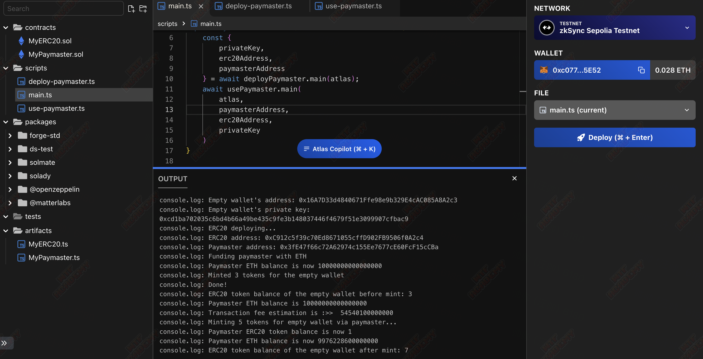

# WTF zkSync: 5. Contract development

This series of tutorials aim to onboard developers to zkSync ecosystem.

Twitter: [@0xAA_Science](https://twitter.com/0xAA_Science)｜[@WTFAcademy_](https://twitter.com/WTFAcademy_)

Community: [Discord](https://discord.gg/5akcruXrsk)｜[WeChat Group](https://docs.google.com/forms/d/e/1FAIpQLSe4KGT8Sh6sJ7hedQRuIYirOoZK_85miz3dw7vA1-YjodgJ-A/viewform?usp=sf_link) |[Official website wtf.academy](https://wtf.academy)

 All codes and tutorials are open source on Github: [github.com/WTFAcademy/WTF-zkSync](https://github.com/WTFAcademy/WTF-zkSync)

---

In this lecture, we will introduce `zkSync` contract development and implement a custom `Paymaster Contract` and an `ERC20 Contract`, and allow users to use `ERC20` for `gas` payment.

## 1. Background knowledge:

0. [Basic knowledge of Solidity](https://www.wtf.academy/docs/solidity-101/)
1. [Introduction to Account Abstraction Protocol](https://docs.zksync.io/build/developer-reference/account-abstraction.html)
2. [Introduction to system contracts](https://docs.zksync.io/build/developer-reference/system-contracts.html)
3. [Node environment](https://nodejs.org/en/download)

## 2. The difference between `ETH` and `zkSync`

zkSync Era can handle the vast majority of Ethereum Virtual Machine (EVM)-based smart contracts and maintains high-security standards, reducing the need for repeated security audits. However, there are still some differences, please read the [difference document](https://docs.zksync.io/build/developer-reference/differences-with-ethereum.html) if necessary.

## 3. Implement a `Paymaster` contract

### 3.1 `IPaymaster` interface definition

Before implementing the contract, we first understand the `IPaymaster` interface, [the interface is defined as follows](https://github.com/matter-labs/era-contracts/blob/main/system-contracts/contracts/interfaces/IPaymaster .sol):

```solidity
// SPDX-License-Identifier: MIT

pragma solidity 0.8.20;

import "../libraries/TransactionHelper.sol";

enum ExecutionResult {
     Revert,
     Success
}

bytes4 constant PAYMASTER_VALIDATION_SUCCESS_MAGIC = IPaymaster.validateAndPayForPaymasterTransaction.selector;

interface IPaymaster {
     /// @dev This function can only be called by the bootloader to verify whether the paymaster implementation agrees to pay for the transaction. If the payer is willing to pay for the transaction, this method must send at least tx.gasprice * tx.gasLimit to the operator
     /// @param _txHash transaction hash value
     /// @param _suggestedSignedHash The transaction hash value signed by EOA
     /// @param _transaction transaction itself
     /// @return magic If the paymaster agrees to pay the transaction fee, the return value should be equal to the signature of the validateAndPayForPaymasterTransaction method.
     /// @return context The "context" of the transaction: a byte array of up to 1024 bytes in length to be passed to the account's postTransaction method.
     /// @dev Developers should try to retain as many steps as possible, regardless of whether the transaction is valid, because this method is also used for gas fee estimation (excluding some necessary data, such as signatures).
     function validateAndPayForPaymasterTransaction(
         bytes32 _txHash,
         bytes32 _suggestedSignedHash,
         Transaction calldata _transaction
     ) external payable returns (bytes4 magic, bytes memory context);

     /// @dev is called by bootloader after transaction execution.
     /// @param _context, the "context" of execution, returned by the "validateAndPayForPaymasterTransaction" method.
     /// @param _transaction, user's transaction
     /// @param _txResult, transaction execution result (success or failure).
     /// @param _maxRefundedGas, the upper limit of gas that can be refunded to paymaster.
     /// @dev The actual amount refunded depends on the amount of gas consumed by the "postOp" itself, so developers should consider this.
     function postTransaction(
         bytes calldata _context,
         Transaction calldata _transaction,
         bytes32 _txHash,
         bytes32 _suggestedSignedHash,
         ExecutionResult_txResult,
         uint256 _maxRefundedGas
     ) external payable;
}
```

But one thing to note is that `postTransaction` is optional and is called after the transaction is executed. Note that unlike EIP4337, this method is not guaranteed to be called. In particular, this method will not be called if the transaction fails with an `out of gas` error.

### 3.2 `Paymaster` contract implementation

The overall contract framework is as follows:
```solidity
// SPDX-License-Identifier: MIT
pragma solidity ^0.8.0;

import {IPaymaster, ExecutionResult, PAYMASTER_VALIDATION_SUCCESS_MAGIC} from "@matterlabs/zksync-contracts/l2/system-contracts/interfaces/IPaymaster.sol";
import {IPaymasterFlow} from "@matterlabs/zksync-contracts/l2/system-contracts/interfaces/IPaymasterFlow.sol";
import {TransactionHelper, Transaction} from "@matterlabs/zksync-contracts/l2/system-contracts/libraries/TransactionHelper.sol";

import "@matterlabs/zksync-contracts/l2/system-contracts/Constants.sol";

import "@openzeppelin/contracts/token/ERC20/IERC20.sol";
import "@openzeppelin/contracts/access/Ownable.sol";

contract ApprovalPaymaster is IPaymaster, Ownable {
     uint256 constant PRICE_FOR_PAYING_FEES = 1;

     address public allowedToken;

     modifier onlyBootloader() {
         require(
             msg.sender == BOOTLOADER_FORMAL_ADDRESS,
             "Only bootloader can call this method"
         );
         _;
     }

     constructor(address _erc20) {
         allowedToken = _erc20;
     }

     function validateAndPayForPaymasterTransaction(
         bytes32,
         bytes32,
         Transaction calldata _transaction
     )
         external
         payable
         onlyBootloader
         returns (bytes4 magic, bytes memory context)
     {
         // To be implemented
     }

     function postTransaction(
         bytes calldata _context,
         Transaction calldata _transaction,
         bytes32,
         bytes32,
         ExecutionResult_txResult,
         uint256 _maxRefundedGas
     ) external payable override onlyBootloader {
       // Optional function is not implemented here
     }

     receive() external payable {}
}
```
The `onlyBootloader` defined in it ensures that the `validateAndPayForPaymasterTransaction` and `postTransaction` functions can only be called by `BOOTLOADER_FORMAL_ADDRESS`.

The core implementation here is the `validateAndPayForPaymasterTransaction` function, which we will interpret in turn:

```solidity
magic = PAYMASTER_VALIDATION_SUCCESS_MAGIC;
require(
     _transaction.paymasterInput.length >= 4,
     "The standard paymaster input must be at least 4 bytes long"
);

bytes4 paymasterInputSelector = bytes4(
     _transaction.paymasterInput[0:4]
);
if (paymasterInputSelector == IPaymasterFlow.approvalBased.selector) {
   // To be implemented
} else {
     revert("Unsupported paymaster flow");
}
```

```js
   // Encoding the "ApprovalBased" paymaster flow's input
const paymasterParams = utils.getPaymasterParams(PAYMASTER_ADDRESS, {
   type: "ApprovalBased",
   token: TOKEN_ADDRESS,
   // set minimalAllowance as we defined in the paymaster contract
   minimalAllowance: BigInt("1"),
   // empty bytes as testnet paymaster does not use innerInput
   innerInput: new Uint8Array(),
});
```

Here we verify whether `paymasterInput` supports payment transaction fees, otherwise the entire output will be directly reverted. In order to facilitate understanding, the js code for encoding the `ApprovalBased` payment process is posted here.

```solidity
(address token, uint256 amount, bytes memory data) = abi.decode(
   _transaction.paymasterInput[4:],
   (address, uint256, bytes)
);

// Verify whether the token is the same
require(token == allowedToken, "Invalid token");

// We verify whether the user has provided sufficient authorization
address userAddress = address(uint160(_transaction.from));

address thisAddress = address(this);

uint256 providedAllowance = IERC20(token).allowance(
   userAddress,
   thisAddress
);
require(
   providedAllowance >= PRICE_FOR_PAYING_FEES,
   "Min allowance too low"
);

```

The main thing here is to verify whether the authorized `token` amount is sufficient. In the actual development process, it is actually necessary to deduce the required authorization amount based on the actual gas. For the sake of simplicity, we have written a fixed 1 in the contract.

```solidity
uint256 requiredETH = _transaction.gasLimit *
     _transaction.maxFeePerGas;

try
     IERC20(token).transferFrom(userAddress, thisAddress, amount)
{} catch (bytes memory revertReason) {
     if (revertReason.length <= 4) {
         revert("Failed to transferFrom from users' account");
     } else {
         assembly {
             revert(add(0x20, revertReason), mload(revertReason))
         }
     }
}

(bool success, ) = payable(BOOTLOADER_FORMAL_ADDRESS).call{
     value: requiredETH
}("");
require(
     success,
     "Failed to transfer tx fee to the bootloader. Paymaster balance might not be enough."
);
```

The complete code implementation is as follows:

```solidity
// SPDX-License-Identifier: MIT
pragma solidity ^0.8.0;

import {IPaymaster, ExecutionResult, PAYMASTER_VALIDATION_SUCCESS_MAGIC} from "@matterlabs/zksync-contracts/l2/system-contracts/interfaces/IPaymaster.sol";
import {IPaymasterFlow} from "@matterlabs/zksync-contracts/l2/system-contracts/interfaces/IPaymasterFlow.sol";
import {TransactionHelper, Transaction} from "@matterlabs/zksync-contracts/l2/system-contracts/libraries/TransactionHelper.sol";

import "@matterlabs/zksync-contracts/l2/system-contracts/Constants.sol";

import "@openzeppelin/contracts/token/ERC20/IERC20.sol";
import "@openzeppelin/contracts/access/Ownable.sol";

/// @author Matter Labs
/// @notice This smart contract pays the gas fees for accounts with balance of a specific ERC20 token. It makes use of the approval-based flow paymaster.
contract ApprovalPaymaster is IPaymaster, Ownable {
     uint256 constant PRICE_FOR_PAYING_FEES = 1;

     address public allowedToken;

     modifier onlyBootloader() { // You can use this modifier in the validateAndPayForPaymasterTransaction function to limit only [bootloader](https://docs.zksync.io/build/developer-reference/system-contracts.html#bootloader) to be callable
         require(
             msg.sender == BOOTLOADER_FORMAL_ADDRESS,
             "Only bootloader can call this method"
         );
         _;
     }

     constructor(address _erc20) {
         allowedToken = _erc20;
     }

     function validateAndPayForPaymasterTransaction(
         bytes32,
         bytes32,
         Transaction calldata _transaction
     )
         external
         payable
         onlyBootloader
         returns (bytes4 magic, bytes memory context)
     {
         // By default we consider the transaction as accepted.
         magic = PAYMASTER_VALIDATION_SUCCESS_MAGIC;
         require(
             _transaction.paymasterInput.length >= 4,
             "The standard paymaster input must be at least 4 bytes long"
         );

         bytes4 paymasterInputSelector = bytes4(
             _transaction.paymasterInput[0:4]
         );
         // Approval based flow
         if (paymasterInputSelector == IPaymasterFlow.approvalBased.selector) {
             // While the transaction data consists of address, uint256 and bytes data,
             // the data is not needed for this paymaster
             (address token, uint256 amount, bytes memory data) = abi.decode(
                 _transaction.paymasterInput[4:],
                 (address, uint256, bytes)
             );

// Verify whether the token is the same
             require(token == allowedToken, "Invalid token");

             // We verify whether the user has provided sufficient authorization
             address userAddress = address(uint160(_transaction.from));

             address thisAddress = address(this);

             uint256 providedAllowance = IERC20(token).allowance(
                 userAddress,
                 thisAddress
             );
             require(
                 providedAllowance >= PRICE_FOR_PAYING_FEES,
                 "Min allowance too low"
             );

             // Note, that while the minimal amount of ETH needed is tx.gasPrice * tx.gasLimit,
             // neither paymaster nor account are allowed to access this context variable.
             uint256 requiredETH = _transaction.gasLimit *
                 _transaction.maxFeePerGas;

             try
                 IERC20(token).transferFrom(userAddress, thisAddress, amount)
             {} catch (bytes memory revertReason) {
                 // If the revert reason is empty or represented by just a function selector,
                 // we replace the error with a more user-friendly message
                 if (revertReason.length <= 4) {
                     revert("Failed to transferFrom from users' account");
                 } else {
                     assembly {
                         revert(add(0x20, revertReason), mload(revertReason))
                     }
                 }
             }

             // The bootloader never returns any data, so it can safely be ignored here.
             (bool success, ) = payable(BOOTLOADER_FORMAL_ADDRESS).call{
                 value: requiredETH
             }("");
             require(
                 success,
                 "Failed to transfer tx fee to the bootloader. Paymaster balance might not be enough."
             );
         } else {
             revert("Unsupported paymaster flow");
         }
     }

     function postTransaction(
         bytes calldata _context,
         Transaction calldata _transaction,
         bytes32,
         bytes32,
         ExecutionResult_txResult,
         uint256 _maxRefundedGas
     ) external payable override onlyBootloader {}

     function withdraw(address _to) external onlyOwner {
         (bool success, ) = payable(_to).call{value: address(this).balance}("");
         require(success, "Failed to withdraw funds from paymaster.");
     }

     receive() external payable {}
}
```

## 4. Create an `ERC20` contract

```solidity
// SPDX-License-Identifier: MIT
pragma solidity ^0.8.0;

import "@openzeppelin/contracts/token/ERC20/ERC20.sol";

/**
  * @dev This contract is for basic demonstration purposes only. It should not be used in production.
  * It is for the convenience of the ERC20fixedPaymaster.sol contract and its corresponding test file.
  */
contract MyERC20 is ERC20 {
   uint8 private _decimals;

   constructor(
     string memory name,
     string memory symbol,
     uint8 decimals_
   ) payable ERC20(name, symbol) {
     _decimals = decimals_;
   }

   function mint(address _to, uint256 _amount) public returns (bool) {
     _mint(_to, _amount);
     return true;
   }

   function decimals() public view override returns (uint8) {
     return _decimals;
   }

   function burn(address from, uint256 amount) public {
     _burn(from, amount);
   }
}
```

## 5. Contract deployment

[Atlas](https://app.atlaszk.com/projects?template=https://github.com/atlas-labs-inc/zksync-custom-paymaster&open=/scripts/main.ts&chainId=280) is used here To deploy the contract, first deploy the `ERC20` contract:

[Address 0x0395...7830 | zkSync Era Block Explorer](https://sepolia.explorer.zksync.io/address/0x0395106874351FBCCd3cfFCcbc3Be5236Bd47830)


After getting the `ERC20` contract address, deploy the `MyPaymaster` contract:

[zkSync Era Block Explorer](https://sepolia.explorer.zksync.io/address/0xbD50c52192A650E255d73CFC19C72B823b36b332)


Scripts can also be used here for deployment:

```js
import { deployContract, getWallet, getProvider } from "./utils";
import * as ethers from "ethers";

export default async function () {
   const erc20 = await deployContract("MyERC20", ["MyToken", "MyToken", 18]);
   const erc20Address = await erc20.getAddress();
   const paymaster = await deployContract("MyPaymaster", [erc20Address]);

   const paymasterAddress = await paymaster.getAddress();

   // A certain amount of ETH is required to fund the paymaster contract, so a transfer is required here
   console.log("Funding paymaster with ETH...");
   const wallet = getWallet();
   await (
     await wallet.sendTransaction({
       to: paymasterAddress,
       value: ethers.parseEther("0.06"),
     })
   ).wait();

   const provider = getProvider();
   const paymasterBalance = await provider.getBalance(paymasterAddress);
   console.log(`Paymaster ETH balance is now ${paymasterBalance.toString()}`);

// Supplying the ERC20 tokens to the wallet:
   // We will give the wallet 3 units of the token:
   await (await erc20.mint(wallet.address, 3)).wait();

   console.log("Minted 3 tokens for the wallet");
   console.log(`Done!`);
}
```

```js
import { utils, Wallet } from "zksync-ethers";
import { getWallet, getProvider } from "./utils";
import * as ethers from "ethers";
import { HardhatRuntimeEnvironment } from "hardhat/types";

// Put the address of the deployed paymaster here
const PAYMASTER_ADDRESS = "0x08f62b10f5C949Af8d6d8656F86A0Cc3436FB31a";

// Put the address of the ERC20 token here:
const TOKEN_ADDRESS = "0x03615ff4Af613BC55206E179dAccC5631CaA00B6";

function getToken(hre: HardhatRuntimeEnvironment, wallet: Wallet) {
   const artifact = hre.artifacts.readArtifactSync("MyERC20");
   return new ethers.Contract(TOKEN_ADDRESS, artifact.abi, wallet);
}

export default async function (hre: HardhatRuntimeEnvironment) {
   const provider = getProvider();
   const wallet = getWallet();

   console.log(
     `ERC20 token balance of the wallet before mint: ${await wallet.getBalance(
       TOKEN_ADDRESS,
     )}`,
   );

   let paymasterBalance = await provider.getBalance(PAYMASTER_ADDRESS);
   console.log(`Paymaster ETH balance is ${paymasterBalance.toString()}`);

   const erc20 = getToken(hre, wallet);
   const gasPrice = await provider.getGasPrice();

   // Encoding the "ApprovalBased" paymaster flow's input
   const paymasterParams = utils.getPaymasterParams(PAYMASTER_ADDRESS, {
     type: "ApprovalBased",
     token: TOKEN_ADDRESS,
     // set minimalAllowance as we defined in the paymaster contract
     minimalAllowance: BigInt("1"),
     // empty bytes as testnet paymaster does not use innerInput
     innerInput: new Uint8Array(),
   });

   // Estimate gas fee for mint transaction
   const gasLimit = await erc20.mint.estimateGas(wallet.address, 5, {
     customData: {
       gasPerPubdata: utils.DEFAULT_GAS_PER_PUBDATA_LIMIT,
       paymasterParams: paymasterParams,
     },
   });

   const fee = gasPrice * gasLimit;
   console.log("Transaction fee estimation is :>> ", fee.toString());

   console.log(`Minting 5 tokens for the wallet via paymaster...`);
   await (
     await erc20.mint(wallet.address, 5, {
       // paymaster info
       customData: {
         paymasterParams: paymasterParams,
         gasPerPubdata: utils.DEFAULT_GAS_PER_PUBDATA_LIMIT,
       },
     })
   ).wait();

   console.log(
     `Paymaster ERC20 token balance is now ${await erc20.balanceOf(
       PAYMASTER_ADDRESS,
     )}`,
   );
   paymasterBalance = await provider.getBalance(PAYMASTER_ADDRESS);

   console.log(`Paymaster ETH balance is now ${paymasterBalance.toString()}`);
   console.log(
     `ERC20 token balance of the wallet after mint: ${await wallet.getBalance(
       TOKEN_ADDRESS,
     )}`,
   );
}
```

Example of execution using `paymaster`:



At this point the entire contract part is complete, in this tutorial, we learned how to set up the paymaster contract on zkSync Era, we created an `erc20` and formulated the `paymaster` contract so that it accepts single units of the token as cost.
